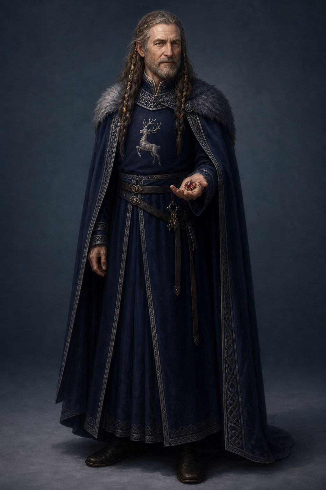

# 黠謀國王設定稿

**已確認外觀：** 年長男性，髮辮混入只有國王可用的細金線；深藍羊毛與銀色細節屬王室視覺，鹿徽與紅寶石別針是可辨識元素。場景中不必總配王冠，避免把他的日常召見畫成純儀式展示。

**人物設定：** 黠謀承認蜚滋，供養並訓練他，同時清楚宣告回報是效忠與日後效力。他能對孩子保有細微的照料，也願為考驗造成的傷害承認責任；然而其治理本質仍是把人放進棋局。後續畫面應同時讓人看見其克制、敏銳與權力的不對等。

