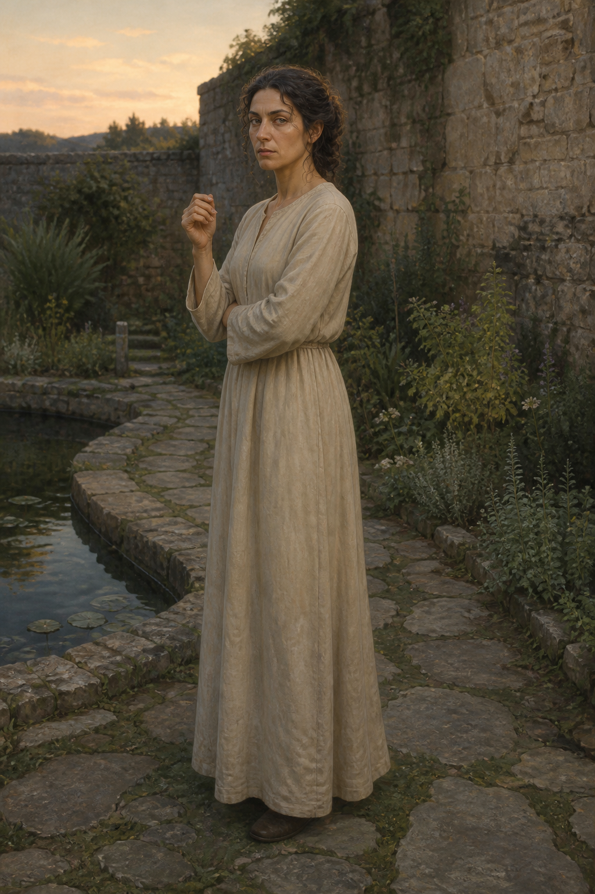

# 耐辛夫人設定稿

**已確認外觀：** 苗條的成年女性，身高略低於十四歲的蜚滋；淺棕色雙眼與棕色眉毛，深色捲髮試著束起，額前與頸側仍散落幾綹捲髮。初次在女人花園出現時穿樸素寬鬆的直筒連衣裙，不配戴王室飾物。

**人物設定：** 耐辛是駿騎的妻子。她先以責備蜚滋的酒意與衣著出現，接著因他未受音樂、詩歌、舞蹈和禮儀教育而憤怒。她替蜚滋爭得王室教育與精技訓練，但這份遲來的照顧同時把他拉進新的規訓與未知風險。後續畫面要保留她的固執、私密與笨拙的關切，不能提前將她畫成溫柔的母親或華麗王妃。

