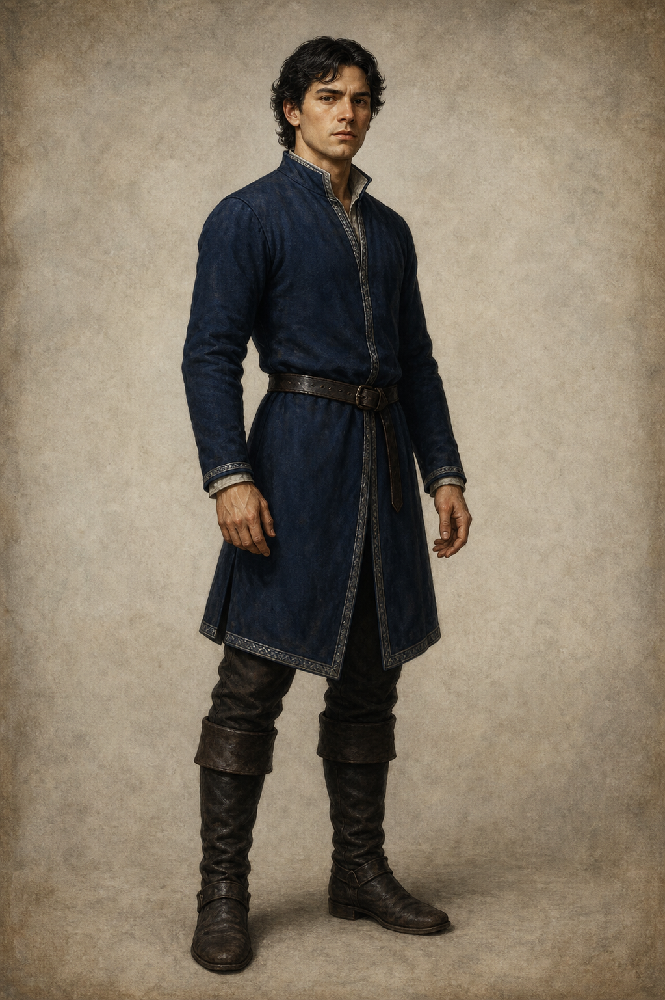

# 惟真王子

**已確認外觀：** 深色微捲髮、身形精瘦結實的年輕成年王子。穿深藍羊毛長上衣、暗色皮帶與長靴；衣著克制實用，僅以細窄銀色滾邊表明王室身分。

**人物設定：** 駿騎之弟，奉命前往潔宜灣要求克爾伐妥善處理守望島瞭望台的人力問題。他關心獵犬力昂，也傾向把問題直接說清、要求執行。第八章只鎖定這份直率及其在外交情境裡的局限；不推演後續決斷或關係。

**首次關聯：** 第 008 章〈百里香夫人〉。

