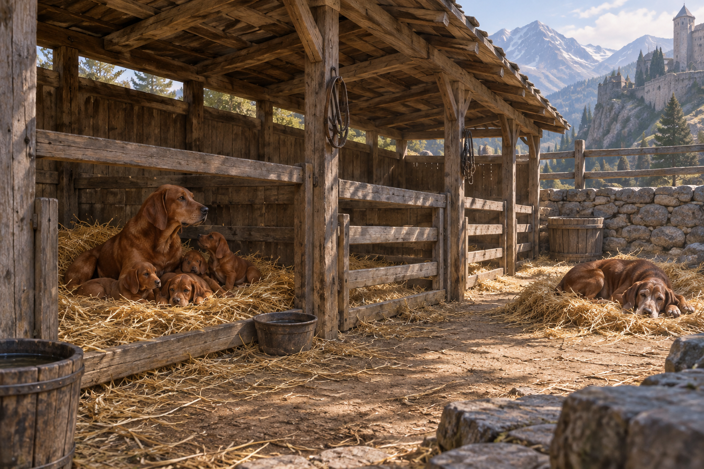

# 頡昂佩狗舍設定稿

**已確認場景：** 宮殿外一間長而低矮的狗舍，內有木製圍欄、稻草與多種獵犬。紅色幼犬和母犬在圍欄裡玩耍；一隻年老的紅棕色獵犬在戶外稻草堆上睡覺。狗舍鄰近山城宮殿，但本章沒有交代精確建材、尺寸或裝飾，不補寫成華麗的宮廷建築。

**視覺約束：** 保留高地午後陽光、粗木、乾草、泥土地與遠山的冷色空氣。設定稿不放可辨識人物，不加入本章以後的犬種資料或劇情物件；場景圖可讓狗舍成為安靜而有年歲的記憶容器。

