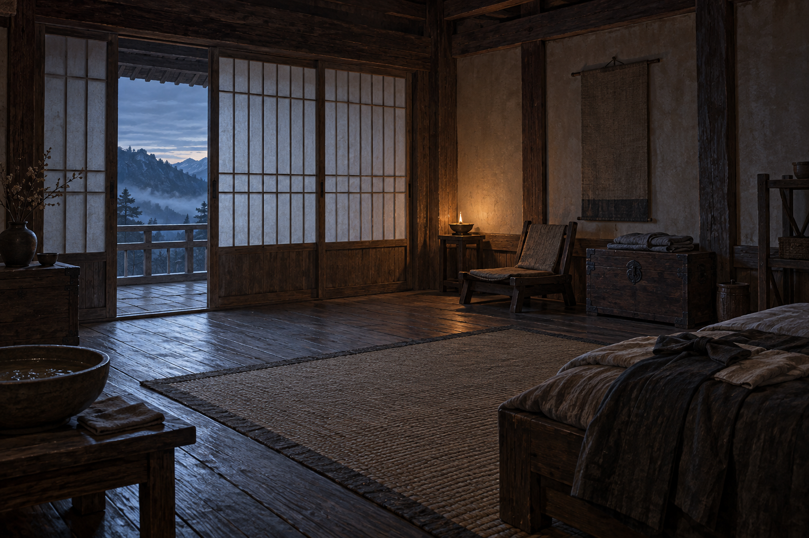

# 頡昂佩客房

## 已確認資訊

- 第 023 章中，蜚滋在頡昂佩王宮擁有一間房；姜萁與博瑞屈把他帶回來後，在此替他整理身體與衣物。
- 房間有可拉動的門；有人趁蜚滋不在時徹底搜過，帶走了刻著橡子的毒藥木盒。
- 房內的精確家具、裝飾與材質沒有被完整描述；本設定只鎖定「王宮客房、拉門、可被搜查的私人物件空間」三項。

## 視覺解讀（可調整）

以頡昂佩已知的樹木建築、低矮室內尺度與柔和自然光作中性背景；不加入章節未確認的宮廷徽記、豪華家具或特定裝飾。場景圖可使用低椅、折疊衣物、簡單水盆作為不搶主體的生活痕跡，但不得讓它們承載新的劇情資訊。

## 禁止

- 不畫溫泉浴室、婚禮禮台或帝尊的行動。
- 不畫毒藥木盒的內容物，不替「誰搜過房間」下結論。
- 無文字、無水印。

