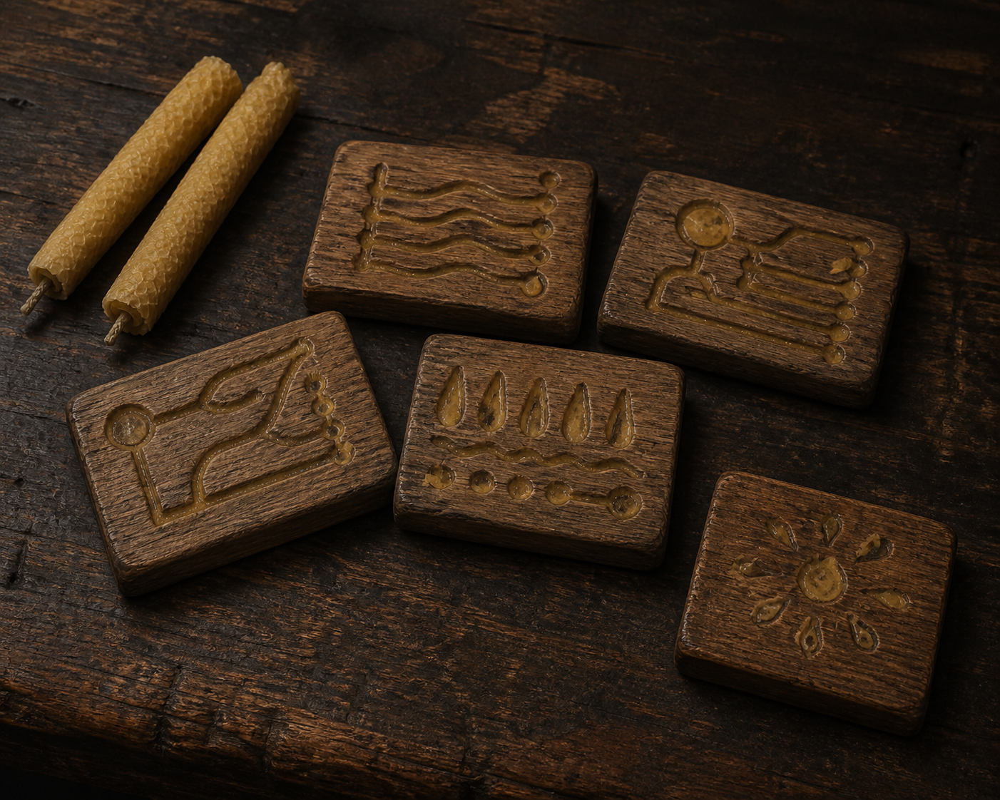

# 莫莉母親留下的木牘

**已確認外觀：** 五片小型、邊緣磨圓的深色木片，淺刻凹槽中殘留蜂蜜色蠟質；可與兩支手捲蜂蠟長燭一同出現。插圖中不將刻文畫成可讀文字，以免製造文本未明示的內容。

**敘事功能：** 前四片記錄用於病痛的蠟燭配方；最後一片寫下莫莉・小花束的本名與生日燭配方。它把母親已逝／缺席的照料留在實用手藝中，也讓莫莉重新取得自己的名字。

**首次關聯：** 第 006 章〈駿騎的影子〉。

