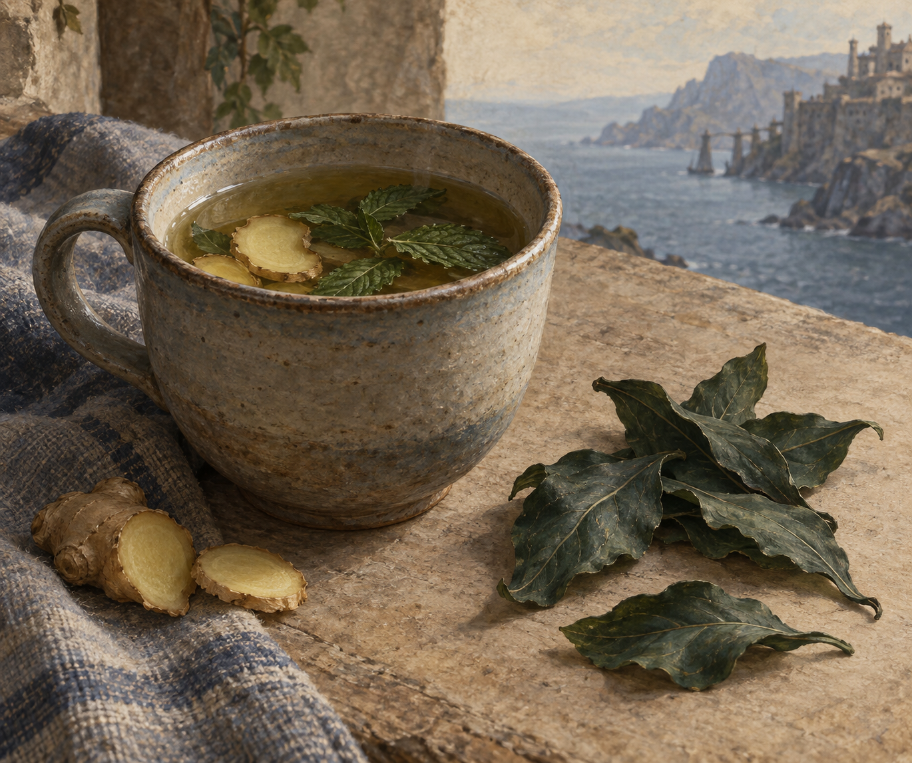

# 帶走我的草葉與茶

**已確認內容：** 男孩把兩片 take-me-away 草葉混進薑與薄荷茶裡；蜚滋知道再多一些可能會使人發瘋。這裡鎖定的是茶、薑、薄荷、少量匿名草葉與危險的劑量界線，不宣稱草葉的真實植物外觀。

**視覺設定：** 樸素杯中的淡色熱茶、幾片可辨認的薑與薄荷，以及杯旁少量深色、形狀不精確的乾草葉。整體是實用的照料物件，不發光、不冒出魔法特效，也不加入藥瓶標籤或現代醫療意象。

**禁止補完：** 不畫可讀標籤、特定現實植物的科學辨識、毒藥瓶、幻覺或服用後效果；不將茶畫成治癒創傷的萬靈藥。

