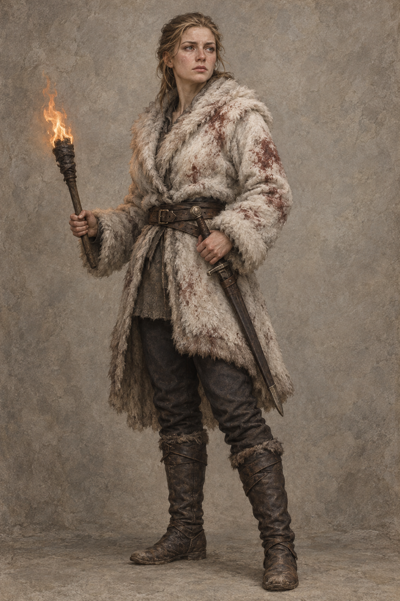

# 珂翠肯設定稿

**已確認外觀：** 山嶽出身的年輕成年女性，淺棕至深金色頭髮簡單束起，穿著白色冬季毛皮外套、深色實用長褲與磨舊騎馬靴；外套與靴上仍留著襲擊後的血痕。她帶著簡單的劍，不畫華麗王冠、宮廷禮服或未在本章確認的徽章。表情堅定而克制，眼中可以有哀傷與淚光。

**敘事設定：** 第八章中，她把原本要延續的復仇獵殺改造成辨認死者、清洗遺容、火葬、命名與共同悼念的儀式。她的真心不是政治能力的反面；她正是用對死者的尊重讓一群被怒火推動的人重新成為共同體。設定只鎖定本章已明示的血痕、冬裝、騎乘與領導姿態，不補入後續王室事件、關係或命運。

**第十章新增確認：** 在公鹿堡的私人起居室裡，她可穿著柔軟的及膝短袖束腰上衣、綁腿與簡單的綠藍小珠項鏈；不戴王冠，也不穿厚重宮廷禮服。她已從前章的血與風雪中重新站穩，神情尊貴而安靜，能以原智感受生命之網，但畫面不把這種感受畫成光環、符文或其他可見魔法特效。

**第十二章新增確認：** 她在公鹿堡可穿簡單的綠袍與綠披風，不戴珠寶；在雪覆的烽火台舊花園中，她以發現雕像、花盆、水盆與石凳的喜悅重新召回生命力。畫面只呈現尚未整理的冬季遺跡與她的想像，不把花園提前畫成已完成的春季景觀。

