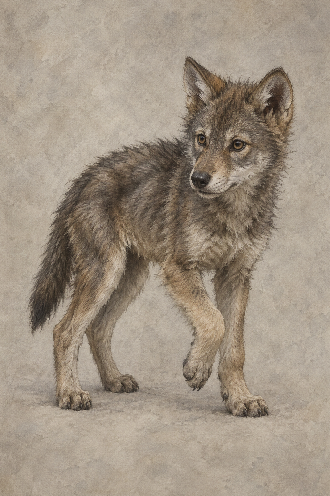

# 小狼／夜眼設定稿

**已確認外觀：** 一隻仍在成長中的幼狼，灰褐冬毛、身形瘦小但已長出狩獵所需的肌肉；耳朵警覺豎起，眼神敏銳，動作有玩耍與突襲的活力。牠是狼，不畫成家犬、神獸或帶有特殊紋章的生物。

**敘事設定：** 蜚滋在雪中發現牠受虐飢餓，之後祕密以食物、乾草與舊馬毯照料。小狼感覺得到他靠近，也開始期待他的薑餅與陪伴；蜚滋一再說將在春雪融化後放牠回野地，卻已不能否認彼此建立了牽繫。第十一章確認牠名叫夜眼，是兄弟中最晚睜開眼睛的一隻；牠拒絕把人類替牠安排的孤立稱為自由，並在蜚滋遭襲時回頭救他。設定只鎖定已讀章節可見的謹慎、信任、狩獵與兄弟承認，不補入後續能力或命運。

**第31至32章已讀狀態：** 博瑞屈已拔去牠嘴邊的豪豬刺，後續畫面不再留刺。第32章明示牠在雪丘矯健奔行，繪圖保留原稿灰褐毛色、立耳與纖健輪廓，依本章呈現成長中的狼，不把早期幼狼大小固定為不會變化。章末蜚滋以牠的感官準備狩獵，畫面只有一具狼身，不能額外加入透明人影或第二匹狼；不據此裁定蜚滋肉身的命運。

**第33至34篇已讀狀態：** 第33章與蜚滋共享狼生活後，在蜚滋恢復人身時離開並嗥叫；第34篇的邀請是蜚滋心中的狼生活回憶。第34篇心得圖沿用灰褐毛色、立耳與成長後纖健比例，只畫一匹狼；林緣位置、雪與晨光是象徵構圖，不將牠的當前位置或後續命運鎖成事實。設定稿仍為 v1，未重畫。
