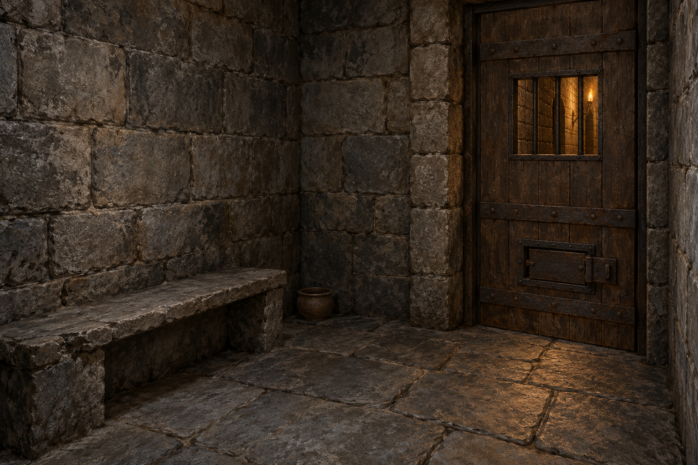

# 公鹿堡地牢小室

**已確認：** 狹小石室，乾燥但寒冷，石板凳兼作床，沒有鋪墊；角落有便盆。門上有帶鐵條的小窗，門下小嵌板可送水與麵包。小窗外是狹窄走廊與對面石牆，火把光自走廊透入，不能據此分辨日夜。牢房離酒窖不遠，但圖像不新增原文未交代的通道或平面配置。

**視覺設定：** 磨舊灰色石牆與石板地、粗木牢門、暗鐵窗條、貼牆的低矮石凳；具體尺寸、門的位置與鐵條數是便於繪製的視覺約定，並非正文考證。淡琥珀火把光只來自門外；室內不設大窗或自行添加刑具。中性設定稿不含人物、斗蓬、蘋果或血跡。

**章節狀態與禁區：** 第30章耐辛只能在門外碰到蜚滋的手，她因身高與走廊狹窄無法看見室內。後段才收到普隆第的斗蓬，不應出現在本章較早的耐辛來訪畫面。不得增加未讀章節的出口、救援結果、魔法特效、文字或水印。

**視檢：** 已打開 v1；石凳無鋪墊、閉合木門、上方鐵窗與下方送食嵌板、角落便盆、門外暖光均存在。無人物或文字。

## 設定稿 prompt

Use case: illustration-story. Neutral environment reference sheet for a medieval fantasy novel, Royal Assassin chapter 30, setting id buckkeep_dungeon_cell. A small dry cold stone prison room in Buckkeep, unoccupied. Three-quarter interior view, worn gray stone blocks and stone slab floor, a low bare stone bench against a wall with no bedding, a small simple chamber pot in a corner. One heavy plain wooden door has a small barred viewing opening at standing hand height and a low sliding food hatch. A very narrow corridor with an opposite stone wall is glimpsed through the opening; dim amber torchlight comes from that corridor, no torch inside. Painterly realistic fantasy book illustration, grounded stone, aged wood, dull dark iron, restrained gray and brown. No people, clothing, restraints, weapons, blood, supernatural elements, exterior daylight windows, letters or watermark. This is an architectural material reference; exact dimensions and number of bars are a visual convention, not extra narrative facts.

