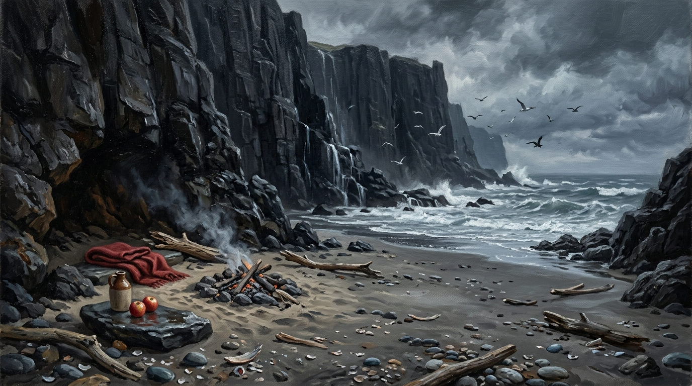

# 公鹿堡懸崖下的隱密海灘與營火

**已確認內容：** 位於公鹿堡險峻黑石峭壁下方的隱密潮間帶沙灘，只有在低潮或風暴短暫平息時可沿峭壁小徑抵達。海灘由潮濕的灰黑細沙、被浪濤磨圓的深色鵝卵石、破碎貝殼與海浪沖刷上岸的浮木構成。高聳的玄武岩峭壁遮擋了部分海風，沙灘近崖壁處築有一處以漂木與圓石堆起的小型避風火坑；平坦大石上鋪著鮮紅色的粗羊毛毯，旁置粗陶酒壺、甜蘋果與裝著葡萄乾麵包的小提籃。

**視覺設定：** 寫實的奇幻文學經典插畫質感。高聳直插陰雲的黑石海崖帶有濕潤的反光，灰藍色海面浪濤洶湧翻滾，碎浪拍打岸礁；遠方天際幾隻海鳥低飛。營火冒出絲縷灰白煙氣，鮮紅羊毛毯與紅蘋果成為冷寂灰暗冷色調中唯一的暖意與脆弱庇護。無人物的中性環境設定稿。

**禁止事項：** 不描繪未讀章節的船隻登陸或戰鬥痕跡；不添加魔法特效光暈；無可讀文字，無現代道具，無浮水印。

