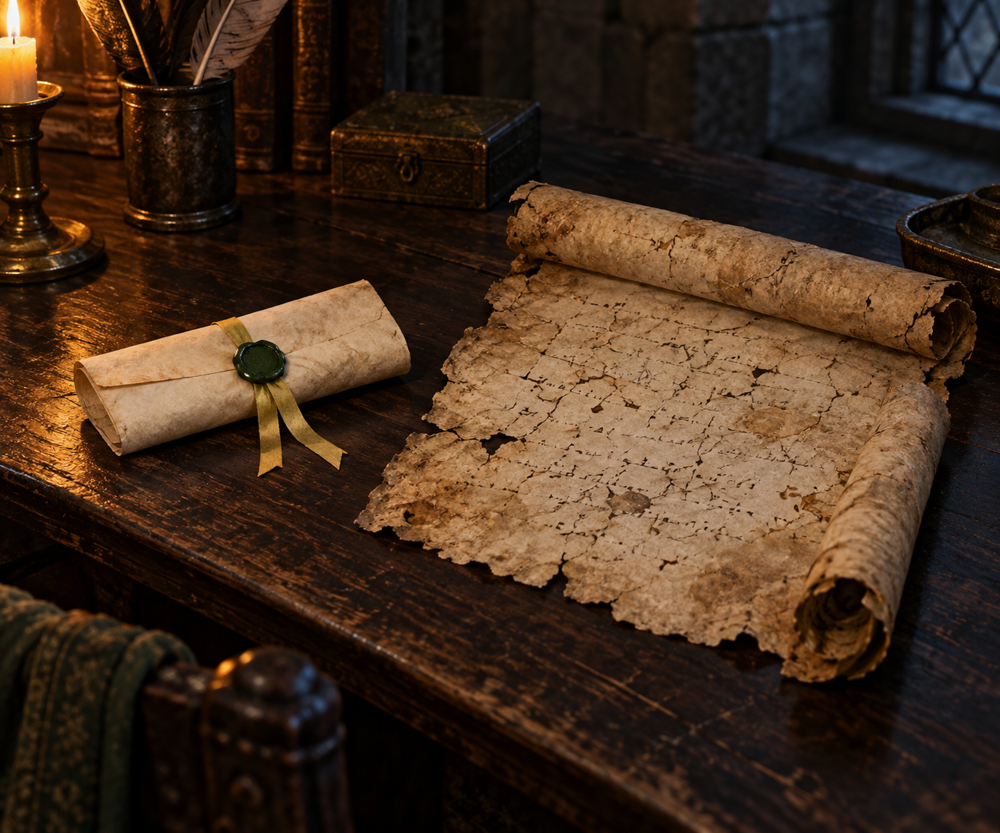

# 婕敏捎來的古靈捲軸

**已確認內容：** 一幅小型捲軸以黃色緞帶束起，綠色蠟滴封口；內含婕敏親筆的短箋，以及她從漣漪堡圖書館找到、僅部分仍清晰可讀的古靈捲軸抄本。蜚滋把它讀作哲理與詩篇般的文字。此卡只描述外觀與本章明示的來歷，不補寫捲軸內容。

**視覺設定：** 兩卷尺寸不同的舊羊皮紙置於深色木面。外層短箋以淡黃緞帶束住，蠟封呈暗綠色；內層抄本有褪色、斷續且不可辨讀的記號，不呈現可讀文字、魔法光效或指定古靈符號。採柔和壁爐暖光與低飽和棕、黃、綠色。

**禁止補完：** 不描繪、轉錄或臆造古靈捲軸內容；不把抄本當成已完整解讀的史料，不添加婕敏後續關係、政治結局或卷軸用途。

