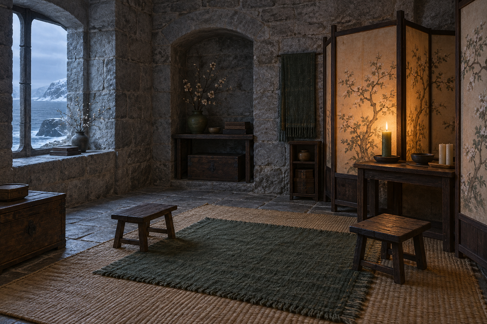

# 珂翠肯的安靜起居室與羊皮紙屏風

**已確認內容：** 珂翠肯的房間簡潔、整齊，沒有公鹿堡常見的厚重織錦與小地毯；地面是簡單草席，房內有加框的羊皮紙屏風，屏風上畫著精細的花樹。房間一角以屏風隔成小凹室，地上鋪綠色羊毛小地毯，放著兩張矮腳凳。珂翠肯把粗厚的綠色月桂樹果蠟燭放到屏風後，以爐火點燃，讓柔和暖光透過花樹畫面。

**視覺設定：** 石牆、乾淨簡單的家具、草席、綠色小地毯與深色木框；畫面可見一支綠色蠟燭與幾支尚未點燃的蠟燭。整體是冬日城堡裡很小、很私人的暖色角落，保持安靜，不畫成宮廷奢華房間。

**禁止補完：** 不加入未在第十章確認的家族徽記、奢華家具、宗教符號、可讀文字或魔法符文；原智只作為角色之間的細微感受，不畫成光線、煙霧、能量線或其他特效。

