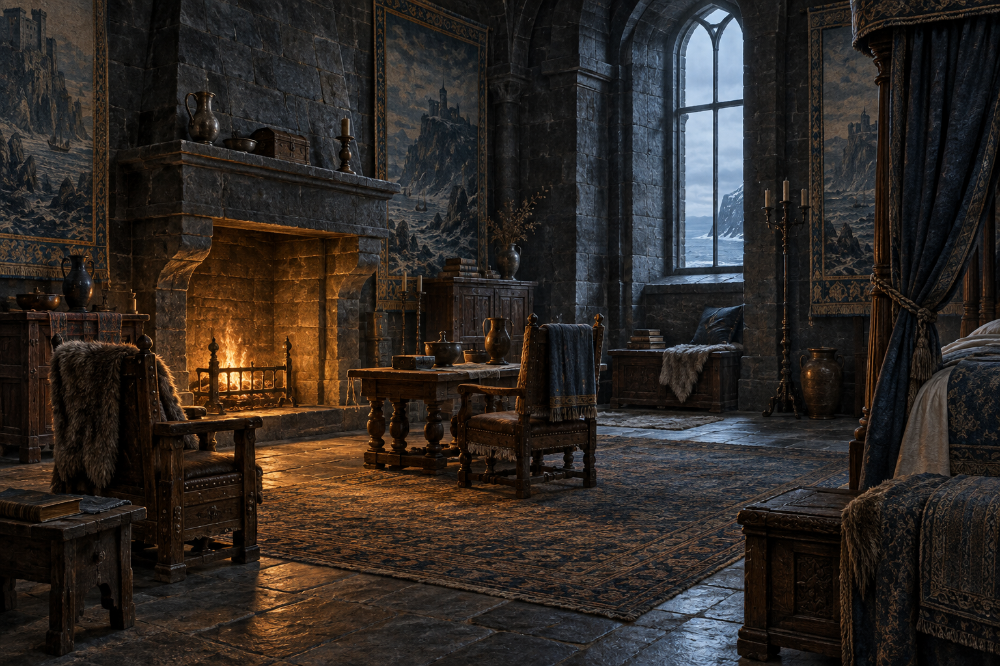

# 黠謀國王臥房與壁爐

**已確認內容：** 蜚滋醒在黠謀國王於公鹿堡的臥房，房內有沉重織錦掛毯、厚實木椅、大石壁爐與繁複床簾；冬日高窗帶入寒意，壁爐提供局部暖光。場景也可承載他靠近爐火、把手伸進火中後被弄臣照料的片段。

**視覺設定：** 黑色石牆、深色木家具、厚織物與高窗的藍灰冬光；暖色只集中在低矮火焰與濕布附近。這是可反覆引用的房間骨架，不添加徽章、王冠、明確地圖或未讀出的宮廷裝飾。

**第29章已讀狀態：** 貴重物品與多數陳設已被搬走，留下較廉價的用品，原先破損的門改以布簾遮擋。沿用石牆、床與壁爐的房間骨架，不能把早期 v1 的豐富陳設當作本章實況。此章近景以木椅、石壁與素暗布簾承載，不新增具識別意義的道具。

**禁止補完：** 不畫泥濘灣的屠殺現場作為現實背景，不把精技視野畫成發光魔法，不加入引用章節之後的王室事件、可讀文字或水印。

