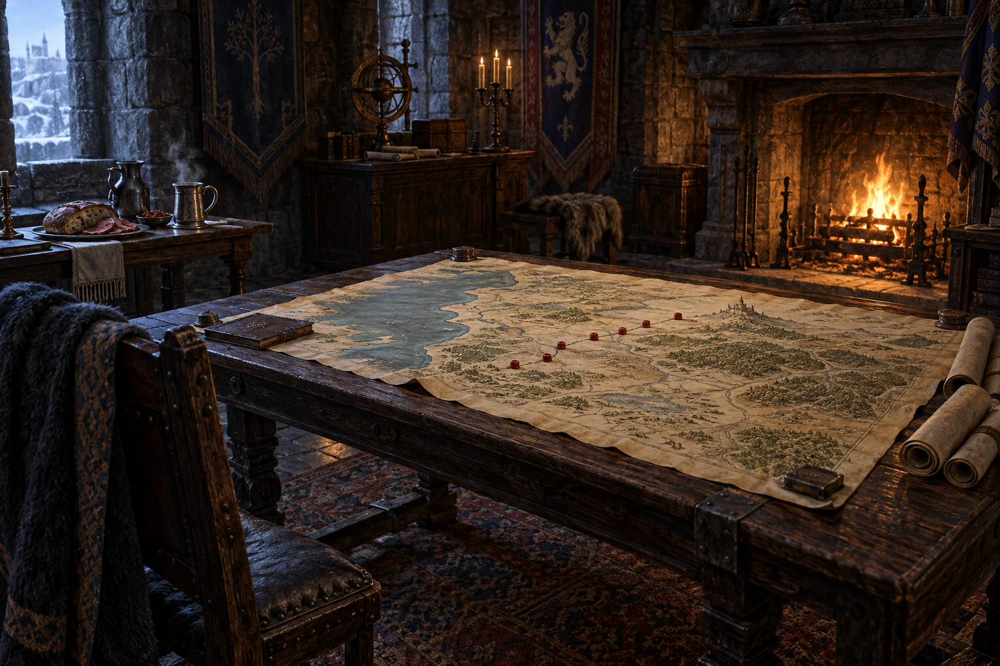

# 惟真的地圖室設定稿

**已確認外觀：** 公鹿堡內的實用工作室，以一張固定的大型海岸與內陸地圖桌為中心；地圖標出淺灘、潮汐沼地、道路與小徑，紅蠟標記散落在逐漸逼近公鹿堡的襲擊地點。壁爐供暖，旁有放著甜香酒、冷肉與麵包的小桌；室內為冬日陰影與爐火暖光並存的石牆、深木與羊皮紙質地。

**敘事設定：** 地圖室不是炫耀王權的廳堂，而是惟真獨自整理零散民怨、嘗試看出模式的工作面。紅蠟標記只表示已讀到第六章的可疑襲擊；不在圖中替未讀事件補上答案，也不把精技畫成視覺特效。

