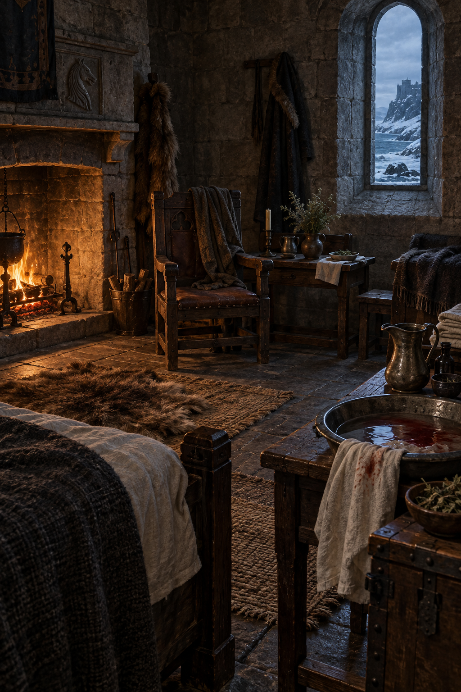

# 狩獵後的惟真房間

## 讀到的設定

- 第十三章〈狩獵〉後，蜚滋在惟真的房間裡接受清理與照料；房間有低矮壁爐、石牆、雪窗、椅子、桌面、藥草、亞麻布與水盆。
- 空間同時承接兩種溫度：壁爐提供身體仍能坐下來的暖意，窗外冬日海岸與雪光則保留任務尚未消化的距離。
- 水盆、折好的布與藥草是清理與照料的物件，不把它們畫成魔法道具或戰鬥陳列。

## 視覺錨點

- 粗糙深色石牆與窄拱窗；窗外是藍灰冬海、積雪山崖與遠方堡壘輪廓。
- 壁爐在畫面一側形成低而穩定的橘色光源；中央有沉重木椅與小桌，前景可見金屬水盆、清水、折布與藥草。
- 材質以磨舊木頭、皮革、羊毛、亞麻、鐵與潮濕石材為主；房間可以有人生活，但不預設後續王室事件。

## 插圖邊界

- 設定圖保持無人物，供第十三章心得場景引用；不把後續新增角色或未讀身分放進房間。
- 不畫小女孩、她的母親、被冶鍊者或屍體；不畫戰鬥、血腥或魔法特效。
- 不提前補寫惟真房間的王室裝飾、秘密用途或後續劇情；不加入可讀文字、徽章或水印。

