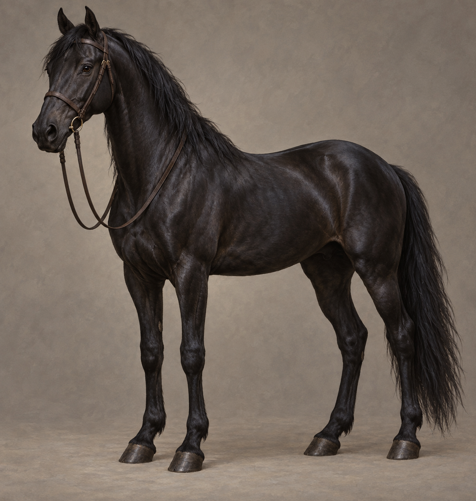

# 🖼️ 箭兒・高大的黑馬

已確認：箭兒是帝尊自己的黑馬，長得很高，背部閃亮，蜚滋在牠剛出生時就認識牠。牠記得蜚滋的氣味、輕咬衣領，博瑞屈將牠訓練得很好。逃亡時沒有馬鞍，蜚滋用鬃毛、膝蓋、體重與韁繩引導；章末馬兒停下回望，後被催促抬膝小跑離開，尚未確認回到馬廄。

具體品種、歲數、眼色、性別的解剖特徵、額部與蹄部斑紋未在本章鎖定。本稿採成年比例、黑鬃黑尾、自然深褐眼與全黑無白斑，這些細節為插畫詮釋。簡單深棕皮革韁具、無王室徽章和裝飾，韁繩鬆弛。正文有韁繩但未詳述皮件結構，不補華麗馬具或皇家烙印。

## 生成提示詞

內建 imagegen，全新角色設定。完整實際提示詞：

Assassin's Quest / Farseer Trilogy volume 3 chapter 9 only, setting ID arrow_black_horse. Create a neutral full-body three-quarter reference of exactly ONE tall adult black horse named Arrow, standing naturally with FOUR complete anatomically correct legs and visible hooves, against plain warm gray studio-like background. Tall elegant riding horse, strong athletic but not exaggerated heavy draft build, glossy black coat, black mane and tail, ordinary dark brown eyes, calm alert ears and natural muzzle. Coat markings and breed are unspecified in chapter; this interpretation uses no white blaze or socks, no named breed features. Simple plain dark brown leather bridle with relaxed reins, NO saddle, saddle blanket, stirrups, decorative harness, royal emblem or brand. Reins arranged clearly and safely with no loops tangled around limbs. Realistic painterly fantasy book illustration, natural equine anatomy, fine fur sheen, restrained earth colors and cool shadows. No rider, handler, other animals, injuries, blood, visible genital detail, magic, text, labels, watermark or later-chapter outcome. The horse is well trained and trusts Fitz, not a supernatural creature.

## 視檢

v1 已打開視檢：恰好一匹成年黑馬、四腿與蹄完整，高大修長但不誇張，黑鬃黑尾、無白斑與新傷；普通深棕韁具、鬆韁未纏腳，沒有鞍、鞍毯、騎士或王室標誌。背景中性，無文字水印。毛色的棕灰反光屬自然光照，不改成另一匹棕馬。

