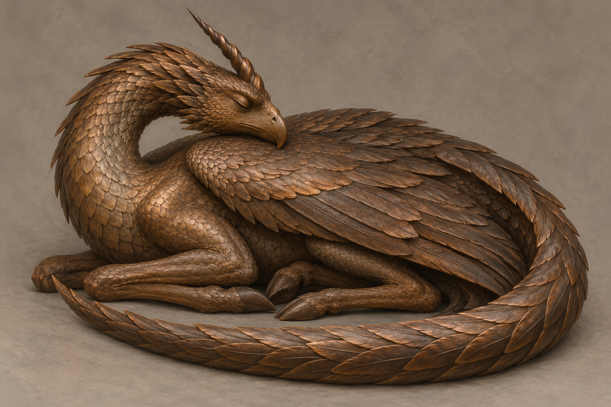

# 🖼️ 銅棕鷹喙獨角龍

已確認：銅棕色光滑鱗皮、細瘦身體、緊摺雙翼、長尾環繞身體、長頸如睡鵝般彎在背上、鳥形頭與鷹喙、額頭一根尖銳螺旋角、四肢收在身下。水壺嬸觸摸其額頭與角；蜚滋與夜眼的生命感知和同伴觸摸到的冷石並存。它不同於前一條金綠冠毛龍，也不是牡鹿角人面像。

設定稿的精確鱗片排列、翼形、爪形與色澤分布為視覺詮釋。前足略向前露出，以辨識四肢；無裂痕、基座、發光或醒來動作。年齡、來源、是否及如何醒來均未知。以 Characters 建檔是供生物輪廓引用，不宣告它已被證實為活體。

## 生成提示詞（內建 imagegen）

illustration-story；Assassin's Quest chapter 30；setting id bronze_eagle_stone_dragon。單一完整三分之四側視沉睡有翼生物，中性暖灰背景，寫實奇幻書籍插畫。銅棕色內生色澤的冷石細鱗，非塗漆金屬盔甲；細瘦鹿感身軀，四肢收於身下，兩翼緊摺，長尾環身，長頸如睡鵝回彎背上，鳥頭鷹喙、閉眼、額上一根尖螺旋角。無人、基座、首飾、裂痕、魔法、發光、文字、水印；不解答生命性。

視檢：單一生物、閉眼、鷹喙、單角、摺翼與環尾可辨，四肢收於身下且無額外肢體；無文字與水印。表面有銅色高光，視為本文內生色澤的插畫表達，不據圖補定金屬材質。

