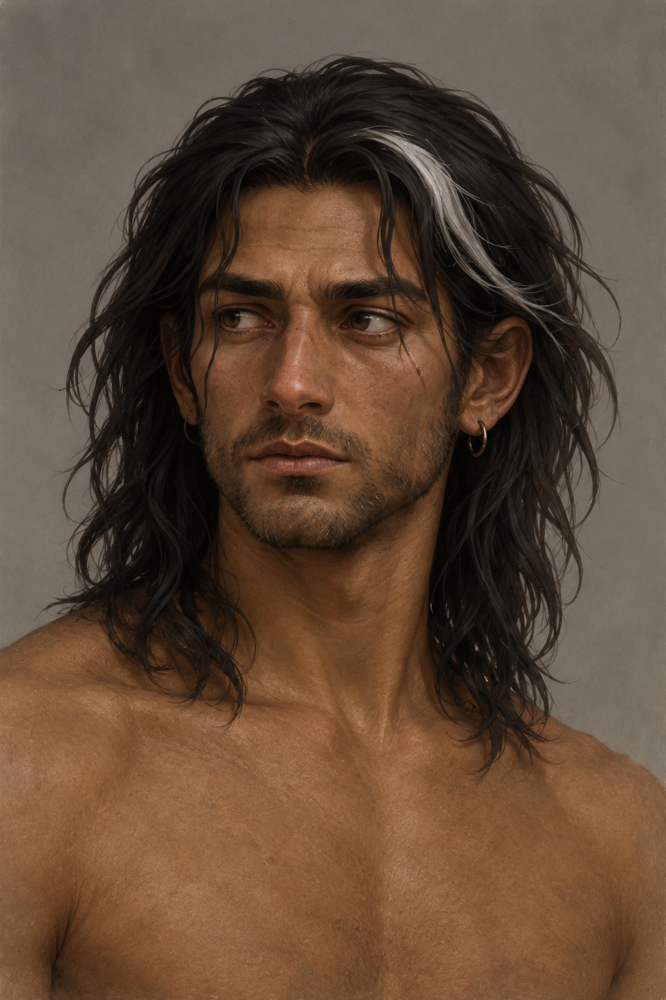
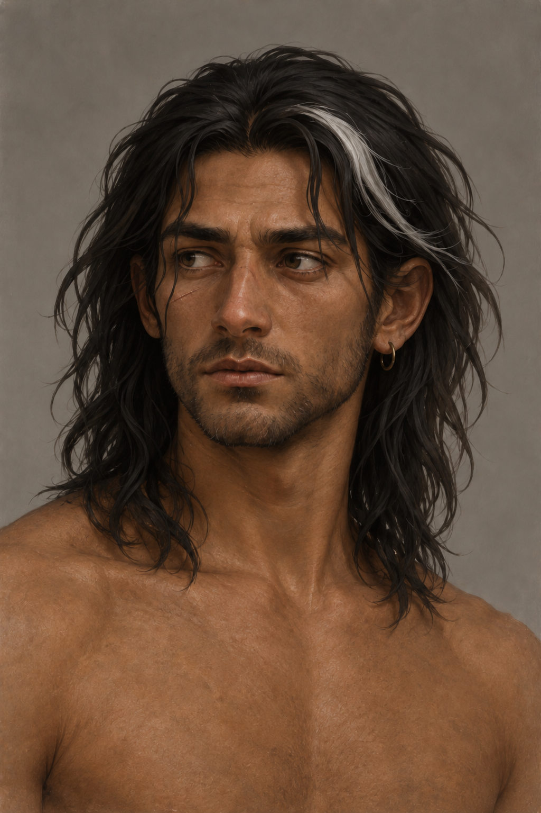

# 🖼️ 蜚滋・法洛赤膊旅途狀態

沿用[復原期蜚滋旅人](fitz_recovering_traveler.md)的成人面貌、近肩深髮與頭皮舊傷白髮束、變形鼻子、右眼下細疤、短鬍鬚與小耳環。第七章行旅多日後，他把髒破襯衫摺入行囊、赤膊趕路，日曬讓膚色更深，身體變得修長、敏捷。他仍有旧傷與刺痛，不能把自覺健康畫成從未受創或完全痊癒。

本稿採中性背景、三分之四角度的頭肩肖像；胸腹、腰帶、刀劍與下半身在裁切之外。正文亦記載褲管捲至小腿、鞋以生獸皮修補，未在這張肖像呈現，後續完整身形出場須另核對。第五章所得長劍仍待道具稿，不以這次裁切宣稱沒有攜帶。肩頭瘀青在本章開始曾被明示，河岸分別已過多日；不自行宣布消失，也不新增未指定的新傷。

## 生成提示詞

內建 imagegen；既有旅人設定已打開，作為身份參考。完整實際提示詞如下：

Create a neutral HEAD AND SHOULDERS PORTRAIT of the adult male traveler Fitz from Assassin's Quest volume 3 chapter 7, setting ID fitz_farrow_bare_torso. Use the attached reference for the same adult identity. Three-quarter facial view, plain warm gray background, painterly realistic literary illustration. Dark brown skin slightly more sun-darkened after outdoor travel, naturally dark eyes, loose near-shoulder dark hair and small white lock, healed crooked nose, subtle healed scar below his anatomical RIGHT eye, short beard and simple small metal earring. Guarded tired expression, calm neutral posture. Frame only head, neck and tops of shoulders, crop ABOVE CHEST; all chest, abdomen, hands, legs and equipment outside frame. No collar or necklace visible because shirt has been packed away during this chapter. Focus on face and hair, natural ordinary appearance, no glamour posing or body emphasis. No invented injury, tattoos, brooch, magical effects, other characters, text, watermark or later story information. This portrait does not establish any recovery of his older injuries.

生成紀錄：第一次腹部以上狀態稿未成功，工具回報 output moderation sexual；本次縮為頭肩肖像，設定範圍亦同步縮小。

## 視檢

v1 已打開視檢：身份與白髮束可辨，但細疤錯在解剖左眼下，且多生一枚耳環，未作場景參考。v2 修正後已打開視檢：解剖右眼（觀者左側）下有細疤，解剖左側不再有長疤，僅留觀者右侧的小耳環；一名成人、深色眼、白髮束、自然頭肩構圖，無文字水印。生成範圍略帶上胸，仍非全身設定；這次場景將裁在肩線，不把此稿作為腰腿或武器參考。

v2 的完整修正提示詞：

Edit this adult male character portrait for two small factual corrections only. Preserve identity, hair, white lock, expression, painterly style, background, framing and ordinary head-and-shoulders composition. The healed facial scar must be BELOW HIS ANATOMICAL RIGHT EYE, which is the eye ON THE LEFT SIDE OF THE IMAGE to the viewer. Remove the long scar under the eye on the viewer's RIGHT side entirely, and place a short subtle healed fine scar below the eye on viewer's LEFT. Keep just one small metal earring on the ear on viewer's RIGHT, remove the extra hoop on viewer's LEFT. No other changes, text or effects.

