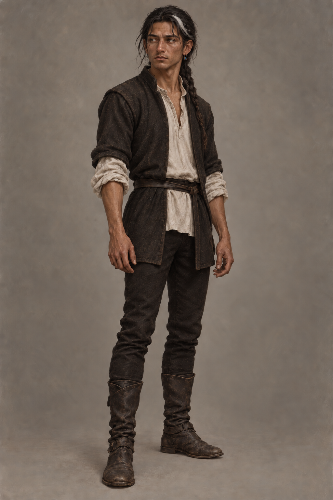

# 🖼️ 蜚滋・頡昂佩拔箭後

第二十一章中，療者拔除了蜚滋背上的箭；到本章泡澡、刮鬍、照鏡時，他的體力比初到頡昂佩時好些，背部傷口仍緊繃，不能說完全痊癒。王室的折磨在臉上留下蒼白疤痕，鼻樑仍歪斜。白髮在額前很明顯；他剛洗淨身體、剃鬍子，並把頭髮綁成戰士髮辮。

他穿切德留下的柔軟白色寬袖羊毛襯衫、黑色毛織綁腿與短外套。沿用前稿深棕皮膚、深色眼睛、偏瘦的年輕成人體態，以及已重新戴回的單枚藍寶石耳環。精確年齡、服裝裁剪和編辮方式未指定，均以低調視覺詮釋處理；不可沿用早期長鬆髮與未修鬍鬚，也不把背傷改畫為已痊癒。

## 生成提示詞

內建 imagegen；先以既有 `fitz_recovering_traveler_v1.png` 作身份參考，再精修同一張角色稿。原始設定生成 prompt：

Create a character design reference for Assassin's Quest / Farseer Trilogy volume 3, chapter 22 'Departure', setting id fitz_jhaampe_after_arrow. The attached image is an identity reference for Fitz's face, dark brown skin, lean young-adult build, dark eyes and crooked healed nose; update only to the chapter-22 appearance. Fitz is now more recovered from his earlier frostbite and back injury, but still bears the torture scars left by Regal: pale scars across his face and the bridge of his nose remains broken/crooked. He has just shaved and washed, and tied his dark hair back in a simple warrior braid; the narrow white lock from an old scalp injury is conspicuous at his forehead. He wears modest mountain clothing given by Chade: plain soft white loose-sleeved wool shirt, simple black wool leggings and short dark outer coat, clean and restrained. His single modest sapphire earring is back on one ear, a small deep-blue stone in aged silver wire net with a functional hook; no other jewelry. Neutral full-figure three-quarter character study against plain warm-gray backdrop, hands relaxed, calm but tired thoughtful expression, not smiling, no weapons in hand. Realistic painterly fantasy book illustration with visible oil-and-gouache brushwork and subtle paper grain, muted earth and cool gray palette. Exact age, garments' cut and braid intricacy are artistic interpretation; do not invent titles or insignia. Keep the back covered; do not show the healing arrow extraction wound. No blood, fresh injury, magical light, royal heraldry, text, lettering, labels, frame, watermark, wolf, other characters, or future status.

精修 prompt：

Edit the FIRST attached character design to match the specific chapter-22 appearance more clearly. Use the SECOND image only to preserve Fitz's facial identity. Preserve the young adult, lean build, deep brown skin, crooked healed nose, quiet tired expression, plain mountain clothes (soft white loose-sleeved shirt, short dark coat, dark wool leggings), simple sapphire earring and neutral warm-gray background. Change the hairstyle: it is freshly washed and tied securely back into a clear, simple warrior's braid, visible over his shoulder, with one conspicuous narrow white forelock at the forehead. His beard has been freshly shaved, so show clean-shaven cheeks/jaw with no stubble; retain a few pale healed torture scars across face and nose, understated but clearly present. This is a design reference, not a narrative scene. Painterly realistic fantasy book illustration, muted palette, visible fine brushwork. Keep all other design choices steady. No added scars, blood, fresh wounds, back wound, additional jewelry, symbols, weapons, magic, words or watermark.

## 視檢

v1 已打開檢查：白色額前髮束清晰、頭髮收束在肩後的戰士髮辮可辨，鬍子已剃淨，保留歪鼻與淡色臉部舊疤；白襯衫、黑色外套與綁腿符合本章。背傷藏在衣物下，耳環單一且不發光。服裝形制、編辮細節與疤痕精確形狀仍屬插畫詮釋。

