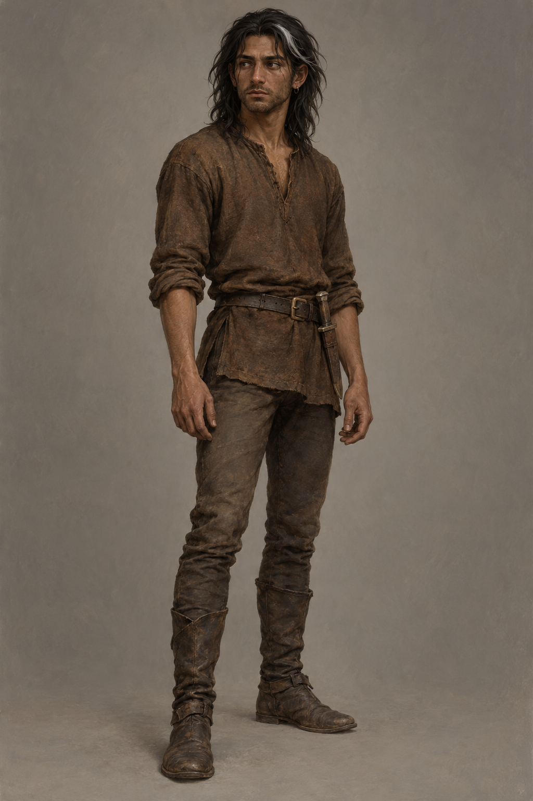

# 🖼️ 蜚滋・復原期旅人

第三章確認頭皮舊傷處的一綹白髮、變形的鼻子、右眼下細疤，以及身體仍會僵硬與發抖。第四章確認頭髮幾乎及肩、入鎮前解開戰士髮辮、未修剪的鬍子、襯衫與綁腿、皮帶與入鞘腰刀；耳環仍在，紅寶石胸針已失落，具體去向未定。深褐皮膚、深色髮眼沿用已讀第一冊的基本設定；不套用十四歲外型。

畫稿採年輕成人與偏瘦身形。精確歲數、衣物色彩、耳環形制與白髮位置未在此章定死：棕色磨舊布料、簡單小金屬環、略短鬍鬚與前側白髮束屬視覺詮釋，不冒充逐字外型資料。溪岸擁抱先於入鎮解辮；場景版須把頭髮收成鬆散戰士髮辮。不要加入新傷、王室制服、發光原智、失落胸針或後续情節。

## 生成提示詞

內建 imagegen。Assassin's Quest / Farseer Trilogy volume 3, chapters 3–4 only; setting ID fitz_recovering_traveler. One young adult Fitz, full body neutral three-quarter view, plain warm gray background. Restrained realistic fantasy book illustration, worn natural fibers, earthy browns and cool gray shadows. Dark brown skin, dark eyes, near-shoulder dark hair with one small white lock from healed scalp injury, loose hair; crooked healed nose, thin healed scar below RIGHT eye, slight untrimmed beard, tired guarded face, lean recovering build. Plain worn brown wool shirt, leggings, old boots, simple belt, modest sheathed waist knife, small simple earring. Empty collar, no brooch or red jewel. Hands empty. No royal clothing, heraldry, fresh wounds, magic glow, text, labels, watermark, wolf, future details or fourteen-year-old proportions.

v1 已打開視檢：一名成人、完整四肢、鬆髮與白髮束、自然深色眼、磨舊棕衣、腰刀入鞘、空衣領與小耳環可辨。細疤低對比，後續近景需明示保留；鼻形克制，不以誇張破相代替受傷狀態。

