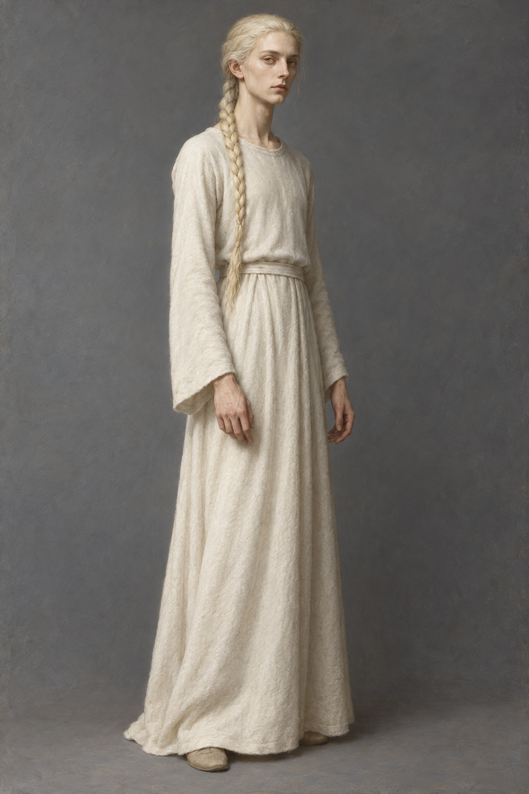

# 🖼️ 頡昂佩的弄臣

第二十章確認：弄臣比一年前長大，身體不再像孩子，仍細瘦而有雜技演員般的肌肉。頭髮向後梳成一股辮子，顏色如剛磨好的麵粉；象牙色皮膚、黃色眼睛、削瘦臉頰、高額頭、直挺長鼻、較薄的嘴唇與更結實的下巴。手指修長細瘦，手腕骨瘦；衣服為樸素圓領羊毛長袍，前段也確認柔軟白羊毛。不可套回斑點弄臣服、幼年體態或純白皮膚。

確切年齡、身高、辮長、鞋款與長袍裁法未知。設定稿採年輕成人的中性清瘦面容、柔和象牙色膚調、米白麵粉色髮、單辮與素白羊毛長袍作視覺詮釋；不以本章補定性別認同、族源或未讀能力。黃眼不發光，象牙皮膚與火光的琥珀色須分開理解。

## 生成提示詞

Use case: illustration-story. Assassin's Quest chapter 20 character reference, setting id fool_jhaampe. A single slender young adult with a neutral androgynous face, lean dancer-acrobat build, ivory skin, natural yellow irises, high forehead, hollow cheeks, straight long narrow nose, thin lips, firmer defined chin. Flour-coloured pale cream hair combed back into ONE braid, no beard. Simple plain round-neck white wool robe, long sleeves, narrow wrists and long thin fingers. Neutral three-quarter standing full-body view against plain cool grey background, relaxed arms, subdued expression. Realistic fantasy literary oil painting, tactile wool and subtle brushwork, soft neutral daylight, no readable text. No jester motley, spots, bells, crown, jewellery, magical glow, halo, wings, weapons, staff, mask, child proportions, glamour pose or watermark. Exact robe tailoring, height and braid length are illustration choices.

v1 已視檢：單一清瘦年輕成人，象牙膚色、米白單辮、高額長鼻、自然黃褐色眼睛、素白圓領長袍與細長雙手可辨；无斑點弄臣服、飾物、文字或魔法光。腰帶、鞋形與辮長為詮釋，不作正文確定資訊；後續場景裁到頭肩，不引用未確認的衣服下半細節。

