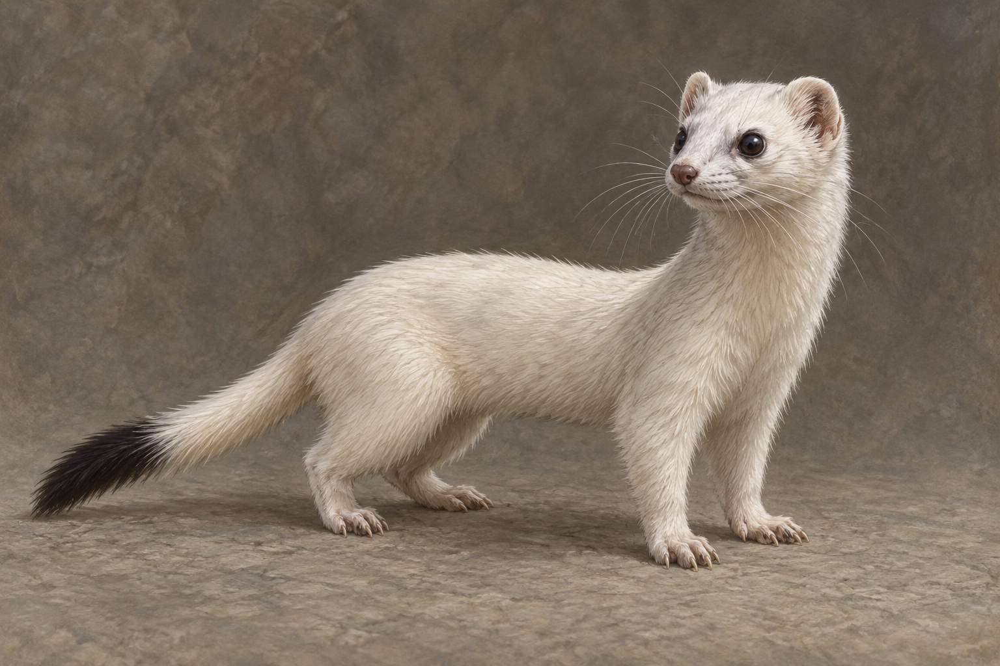

# 小白鼬信使

已確認：非常嬌小，長鬍鬚的臉、小而有爪的腳，可爬上蜚滋衣服、肩與頸；透過原智警告他陷阱。牽繫夥伴大白鼬已死，牠承受失去帶來的痛與盛怒，仍記得警告蜚滋及對帝尊復仇的任務。黑洛夫透過原血者聯絡管道幫助蜚滋，不能將小白鼬改成夜眼的化身，也不補大白鼬的姓名、死因或外貌。牠不願隨蜚滋離去，後續任務成敗未讀。

正文稱作白鼬，沒有逐項描述毛色與尾端。本稿選象牙白冬毛、小黑尾尖、細長身體、四條短腿、小圓耳、深色不發光眼與灰粉鼻尖，均屬可沿用的視覺詮釋，不把黑尾尖寫成已讀事實。是自然小動物，沒有服裝、項圈或人形表情。

設定稿採中性三分之四全身站姿、單一個體、灰褐背景，警覺但不作誇張齜牙。只锁目前送信時點，不加傷口或已完成復仇的符號。

## 生成提示詞

內建 imagegen；完整實際 prompt：

Use case: illustration-story. Asset: neutral creature character design reference for Assassin's Quest / Farseer Trilogy volume 3, chapter 13 Blue Lake. Setting id: little_weasel_messenger. Exactly ONE small ordinary living weasel / ermine, the Old Blood messenger whose human bond partner has died. Confirmed qualities: very small light body, elongated whiskered face, little clawed feet, fiercely alert, capable of climbing clothing; no exact coat color or markings specified. Artistic design interpretation: choose natural winter ivory-white short fur, a tiny black tail tip, small round ears, dark ordinary non-glowing eyes, narrow pink-gray nose, slim long body, four short anatomically credible legs with tiny paws and claws, one slender tail. Not a pet ferret, not a fox, wolf, rabbit, mink giant, plush toy, anthropomorphic hero or fantasy monster. Show full body in a neutral three-quarter standing pose on a plain matte warm-gray surface, low natural eye level, one animal only, all four limbs anatomically present and one tail visible. Realistic painterly literary fantasy book illustration, fine brush texture, muted cream and charcoal, restrained studio daylight, coherent anatomy. Expression attentive and tense, not cute cartoon grin or theatrical snarl. No collar, clothing, armor, jewelry, wings, scars, blood, meat, people, hands, weapons, magic glow, panels, labels, letters, text, border or watermark. This is a reference design, not an invented scene or portrayal of the dead human companion.

## 視檢

v1 已打開檢查：單一小動物，四肢與一條長尾完整，小圓耳、鬍鬚、灰粉鼻尖、象牙白毛與黑尾尖可辨。無文字、水印、項圈或魔法光。毛色與相對較圓的面部為插畫選擇，不作物種鑑定或正文外型補述；场景沿用這張稿的輪廓。

