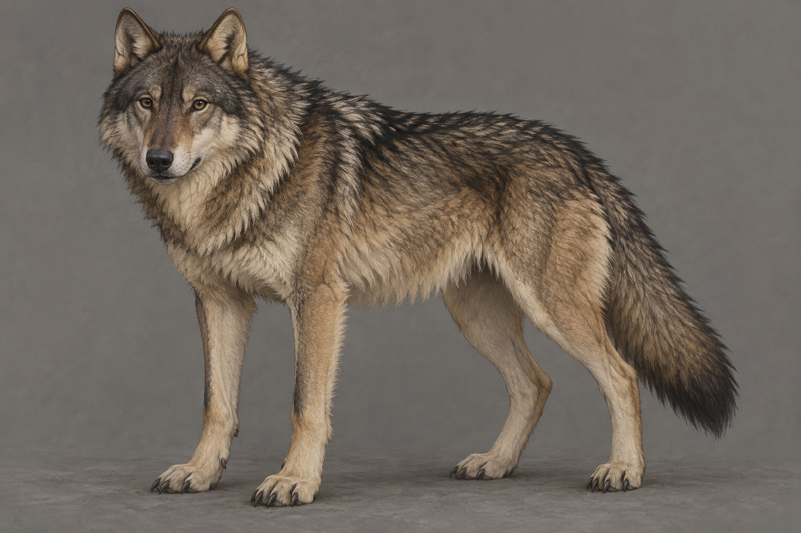

# 🖼️ 成年夜眼

本章已確認：成年、健康，已長大並處在黃金時期；灰狼的複合毛色，深沉的雙眼與鼻口，耳朵和頸部帶淺黃色，硬挺黑色護毛散在毛皮上，腿部粗壯。牠有豐富的尾部表情與足以咬斷鹿腿骨的牙齒。

本設定不是 [第二冊幼狼](../../farseer-trilogy_02/Characters/wolf_cub.md) 的原樣沿用。精確體長、眼色、毛色分界與小屋方位未指定；插畫選擇自然深棕眼、灰褐底毛與淡奶黃耳頸，不以牠的心智交流畫魔法光。未確認疤痕、飾物、項圈或人類服裝。

## 生成提示詞

內建 imagegen，illustration-story。Assassin's Quest chapter 0003，setting id nighteyes_adult。單一成年健康灰狼，完整自然四足站姿，三分之四視角，中性灰背景；成熟身形、粗壯腿部、深沉自然眼睛和深色鼻口、淡奶黃耳頸、灰褐毛皮散布黑色護毛、正常狼尾。寫實奇幻書籍插畫。無幼犬比例、藍色發光眼、雪白毛皮、項圈、衣物、人、文字、水印、符文或魔法。

視檢 v1 通過：單一成年狼、四足與尾部完整、粗壯腿部、灰褐毛色與黑色護毛可辨；耳頸淺黃、眼鼻自然深色，沒有幼犬比例、項圈、魔法、文字或水印。

