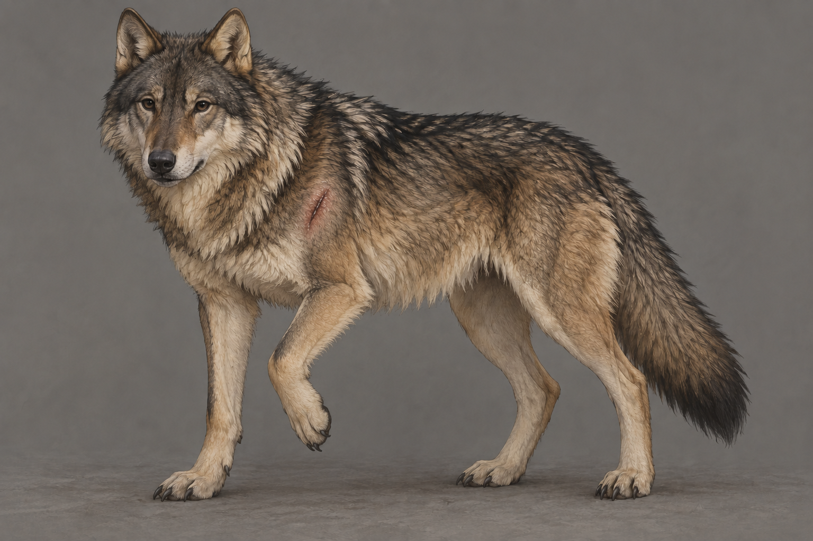

# 🖼️ 夜眼・左肩受傷狀態

沿用 [成年夜眼](nighteyes_adult.md) 的年齡、灰褐底毛、黑色護毛、淡奶黃耳頸、深色自然眼鼻與粗壯腿部。第五章確認左肩被劍劃傷，左前腳彎在胸前，走動會使傷口裂開；第六章仍以三足行走，蜚滋檢查後發現沒有原先想得好，塗上博瑞屈的藥膏。不能把休息或上藥畫成已痊癒。

傷口的精確長度、角度、毛皮分界與藥膏顏色未指定；本稿以小型斜切口、分開的毛與微亮藥膏作克制詮釋。沒有截肢、骨折、繃帶、縫線或持續噴血。此狀態稿只用於本次受傷以後、後續正文確認復原以前的場景；不能回套到第五章捕魚以前。

## 生成提示詞

內建 imagegen，以成年夜眼 v1 為本地參考，開畫前已打開。

Create a reusable state-setting illustration for Assassin's Quest chapter 6, setting id nighteyes_left_shoulder_injured, based strictly on the supplied adult wolf character reference. Exactly one mature healthy-built gray-brown wolf, same robust proportions, coarse black guard hairs, cream-yellow ears and neck, naturally dark eyes and dark muzzle, unadorned tail. Neutral FULL BODY three-quarter view showing the wolf's anatomical LEFT shoulder closest to viewer. The LEFT front paw is gently lifted off ground with the foreleg bent, weight supported by the other THREE legs; do not amputate, no missing limb. One SMALL non-graphic shallow healing sword cut on LEFT shoulder only, parted fur and a little reddish mark beneath dark guard hairs, thin ointment sheen, no flowing blood, no exposed tissue, no stitches or bandage. Old injury still painful when weight bearing, not yet healed. Plain neutral warm gray background, restrained realistic fantasy book illustration consistent with reference. Preserve all FOUR limbs including raised left foreleg, natural dog anatomy, soft neutral light, no humans, no magic, no collar, no armor, no text, no labels, no watermark, no future injury, no juvenile wolf proportions.

v1 已打開視檢：同一成年灰褐狼、四肢皆在，解剖左肩近觀者，左前腳抬起、另外三足著地；左肩小傷口可辨，無暴露組織或流血。耳頸淺黃、黑色護毛與自然眼鼻保留；無項圈、魔法、文字或水印。

