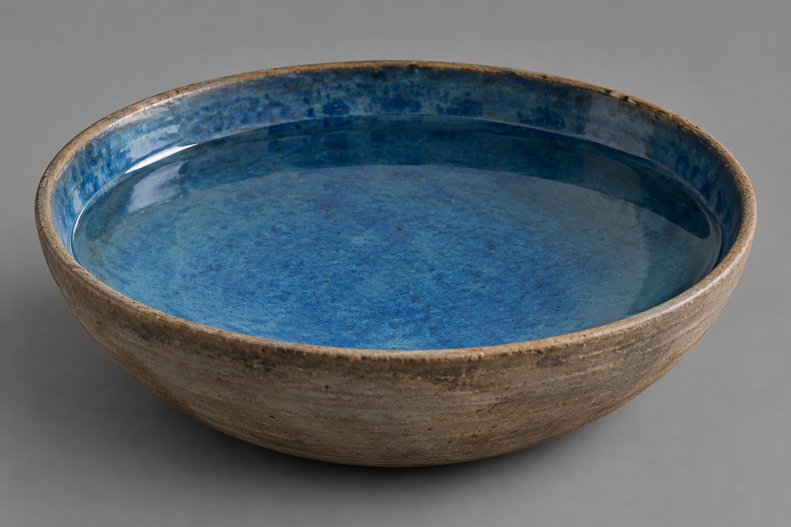

# 🖼️ 藍釉淺碗

已確認：切德帶來一個大的淺碗，內側上藍釉，並倒入乾淨的水。測試時桌上只留下碗與蠟燭；蜚滋看見水和藍色碗底。本卡不指定精確口徑、產地或製作工藝，粗陶外壁與釉色深淺為插畫選擇。

設定稿採斜上方三分之四視圖：大而淺、樸素粗陶外側、藍釉內側、乾淨平靜的水。中性灰背景不帶人物與魔法。蠟燭屬場景光源，不納入碗本體；水晶及藥草雖同章出現，測試構圖不放上桌。

## 生成提示詞

視檢 v1 通過：大而淺的輪廓、粗陶外壁、藍釉與透明水線可辨；沒有異象、人臉、文字或多餘道具。

內建 imagegen，illustration-story。Work: Assassin's Quest / 刺客任務，chapter 0001，setting id blue_scrying_bowl。中性道具設定，單一大而淺的樸素粗陶碗，內側深淺自然的藍釉，裝乾淨水，三分之四斜上視角，灰背景，寫實奇幻書籍插畫，磨舊材質與克制色彩。形狀是浅碗而非杯、盆或高腳杯；無人、手、文字、標誌、水印、符文、預言、鏡像人臉或魔法光。

