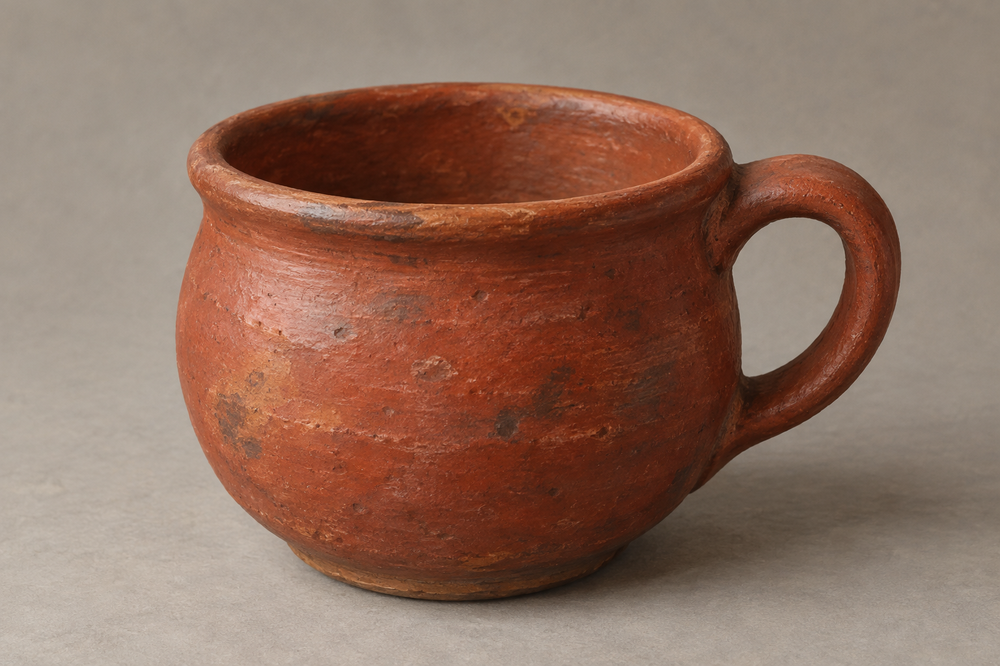

# 營火旁紅陶茶杯

已確認：塔絲煮好晚餐、泡一壺茶之後，兩人在營火旁用厚實的紅色陶杯喝茶。正文未指定杯的精確輪廓、把手、釉色或尺寸；本稿採低矮圓腹、厚杯口、單一環形把手與無紋飾紅褐陶土，皆為可重複引用的插畫詮釋。

不是莫莉生產小屋的茶具，也不是商隊與遊牧者交涉時的特殊茶具。不新增家徽、文字、金屬飾帶或魔法。後續場景使用兩只同款杯，各自獨立，不畫成相連物件。

## 設定稿提示詞

內建 imagegen，實際提示詞：

Use case: illustration-story. Asset type: neutral reusable prop reference for Assassin's Quest / Farseer Trilogy volume 3 chapter 11 The Shepherd. Setting id camp_red_tea_cup. Show exactly ONE humble thick RED EARTHENWARE tea cup, squat rounded body, substantial rolled rim, one simple sturdy loop handle, muted brick-red terracotta with irregular matte firing marks, plain unadorned interior, no decoration. Cup geometry and handle are artistic interpretation; the confirmed text specifies only thick red pottery tea cups. Three-quarter view on a plain warm-gray background with soft neutral daylight. Realistic literary fantasy illustration, restrained gouache and oil brushwork, tactile clay, muted earth tones. No saucer, kettle, second cup, hands, people, lettering, inscription, crest, border, watermark or magic. Not a glossy modern coffee mug, not porcelain, not metallic.

## 視檢

v1 已打開檢查：單只圓腹厚口紅褐陶杯，單一環形把手，陶土斑駁、無圖案及文字；沒有人物、附加器具、水印或魔法。把手、口沿和胎土質感為插畫詮釋。

