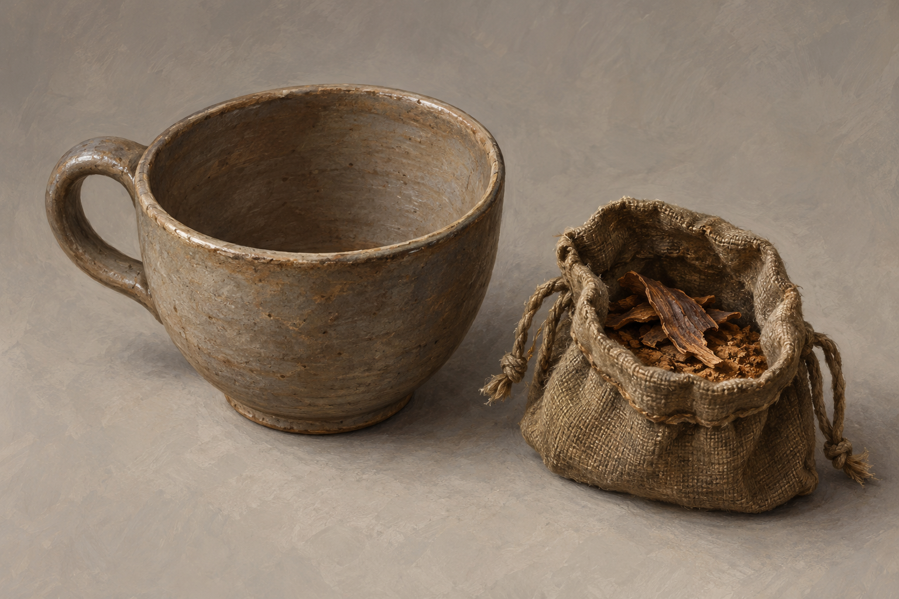

# 🖼️ 精靈樹皮與未盛茶的杯

已確認：蜚滋的樹皮裝在袋中，袋底碾為粉末；帳篷裡有堆放的陶器，他拿起一只茶杯等候，最後放下，未接受樹皮與熱水。水壺嬸當時持袋，不能將放下的杯畫成已泡好。弄臣的茶已喝下，不能與蜚滋的空杯混成同一件物品。

本稿選用灰褐厚口陶杯、圓腹、單環把手與褐色布袋；杯形、陶色、袋材、樹皮碎片外觀均為視覺詮釋，並非正文指定。不沿用第十一章紅陶杯來暗示它一路被攜帶。精靈樹皮為小說虛構物，不對應真實植物、劑量或療法；能力抑制是本章角色說明，不將恢復程度畫定。

## 提示詞（內建 imagegen）

Use case illustration-story. Reusable prop reference, Assassin's Quest chapter 31, setting_id elfbark_choice_cup. Exactly ONE plain EMPTY ceramic tea cup and ONE small open worn cloth herb pouch beside it, on neutral warm gray background. The plain cup is undecorated gray-brown earthenware, rounded bowl shape with one modest handle, clearly visible dry empty interior. Bag contains a few dry curled bark chips and fine brown powder at bottom, contents only slightly visible. These are fictional elfbark; do not identify with real botanical species. Exact cup shape, clay colour, cloth material and bark appearance are artistic interpretation; chapter confirms only pottery cup, bark bag, crushed powder. Three-quarter neutral view, realistic literary fantasy gouache/oil illustration, tactile worn handmade materials, restrained earth palette. No liquid, steam, spoon, kettle, saucer, label, letters, symbols, glowing magic, person or hand, modern medical packaging, text, watermark. No claim of medicinal safety or magical effects.

視檢 v1：一只空杯、一只布袋，杯內乾燥無液體、袋內碎片與粉末可辨，無文字、水印或光效；中性背景，杯把手單一且完整。樹皮紋理僅為詮釋。

