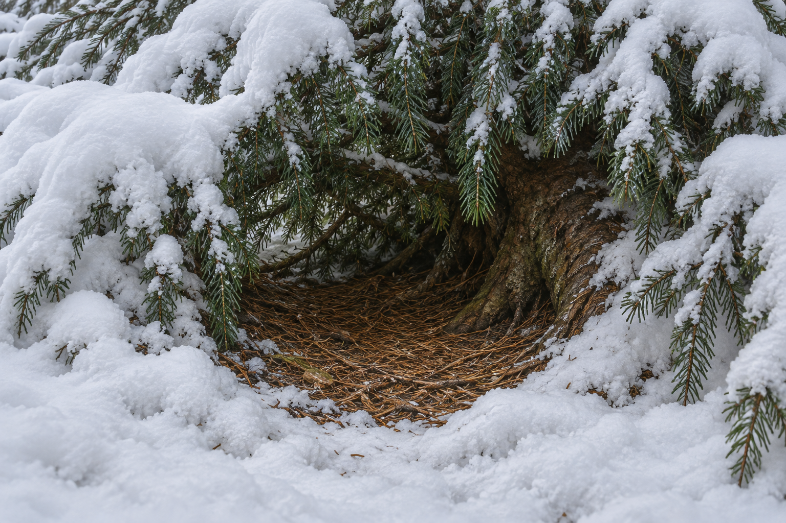

# 🖼️ 積雪常綠樹下的藏身處

已確認：夜眼從冰冷激流爬上岸後，在蜚滋催促下鑽入常綠樹下。積雪將枝葉壓得接近地面，後方有布滿落下針葉的空隙，剛好容牠蜷縮。牠用尾巴遮鼻，漸暖後睡去；章末毛快乾了，仍虛脫。蜚滋不知道牠在河的哪一岸。

視覺詮釋：採類似針葉樹的細枝與暗綠針葉，褐色落針鋪地，天然根部凹隙、不規則雪簷。精確樹種、方位、光線與尺寸不鎖定。不是人造小屋、狼窩或已確認安全的營地，不出現河岸定位標誌。

## 生成提示詞

內建 imagegen，illustration-story。Assassin's Quest chapter 0017，setting id evergreen_needle_shelter。無動物的近景場景設定圖，從地面看雪壓低的常綠枝葉，後方有可容一匹狼蜷縮的淺根部空隙，乾褐落針鋪地、雪簷和暗綠細針葉、自然冷灰冬日光，細膩寫實奇幻油畫。無人物、動物、河岸定位、建築、帳篷、毯子、火、魔法、文字或水印。不是深洞或溫暖室內。

視檢 v1 通過：低垂積雪枝葉、淺根部空隙與落針地面可辨；沒有動物、建築、毯子、火、文字或水印。空間小而自然，不宣稱河岸方位或永久安全。

