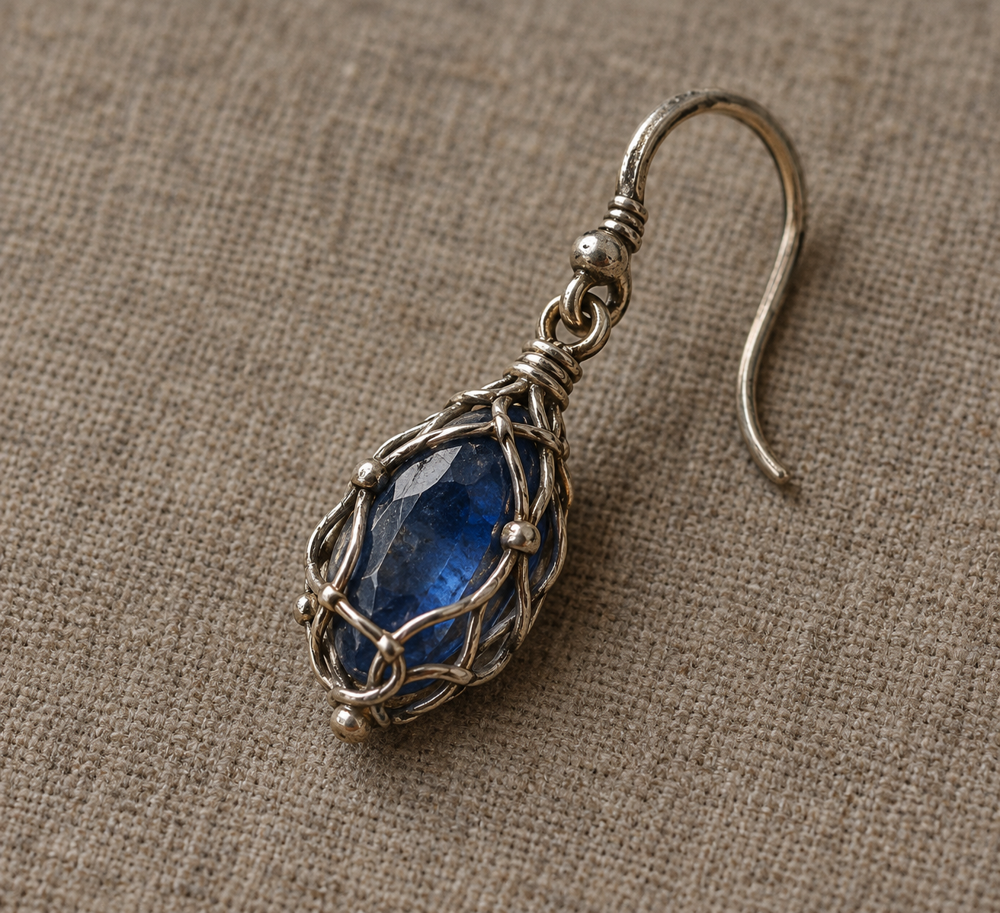

# 自由人藍寶石耳環

已確認：商人檢視精緻銀線組成的網，網住一顆藍寶石；蜚滋可鬆開小鉤，將耳環從耳朵取下。商人將其辨認為布傳氏族的自由人耳環，解說耳環與前奴隸臉上家族刺青相符時，能證明持有者獲釋並在恰斯自由通行。此處是本章商人的辨認與制度說明，不新增家徽、文字、符文或臉部刺青圖樣。

蜚滋知道它經博瑞屈、父親與耐辛傳到自己手上；推想它可能屬於博瑞屈祖母，尚未證實。本稿不畫前任持有者，也不補傳承儀式。寶石切割方式、精確尺寸、銀絲編織紋路與磨損程度未指定；採小橢圓藍寶石、細銀絲交錯網和樸素上端小鉤作插畫詮釋。不是紅寶石胸針，也不是鏈章、戒指或項鍊。

設定稿用中性三分之四近景，單一耳環，灰褐中性背景。藍寶石不發光，銀絲包圍寶石且小鉤可辨。無人物、手、文字、水印及附加珠飾。

## 生成提示詞

內建 imagegen；完整實際 prompt：

Use case: illustration-story. Asset type: neutral prop design reference for the novel Assassin's Quest / Farseer Trilogy volume 3, chapter 10 'Hiring Fair'. Setting id: freedman_sapphire_earring. Create one clear small historical fantasy EARRING, a SINGLE modest deep-blue sapphire held in an intricate open NET of fine SILVER WIRES, with a tiny functional hook clasp at the upper end for fastening into an ear. It is worn and old but skillfully made, small enough to wear on one human ear, not a necklace, not a brooch, not a crown. Blue gem is natural and non-glowing; no rune, family crest, tattoo, inscription or heraldry. Exact unconfirmed cut, size and wire weave are artistic interpretation: choose a small oval subdued translucent sapphire enclosed by an irregular, elegant woven lattice of silver threads, no huge faceted diamond or rhinestone halo. Neutral three-quarter product study resting on plain warm-gray linen or matte neutral background, macro view with believable scale, fine painterly brushwork, realistic literary fantasy book illustration, muted silver, deep blue, warm-gray and brown, restrained natural studio daylight. One object only, no alternative designs, no layout panels, no hands, ears, people, other jewelry, coins, silk pouch or scenery. No text, lettering, label, border or watermark. The object is a token associated with freedom and personal inheritance, but no supernatural effects and no invented historical inscription.

## 視檢

v1 已打開檢查：一枚耳環，藍寶石、銀絲包網、連接環與可穿戴小鉤都可辨識；沒有其他珠飾、人物、文字或水印。金屬暖灰反光仍保留舊銀質感，場景參考須重述銀色而非新增黃金部件。寶石切面、連接環與細小焊點屬視覺詮釋，非正文新增的工藝事實。

