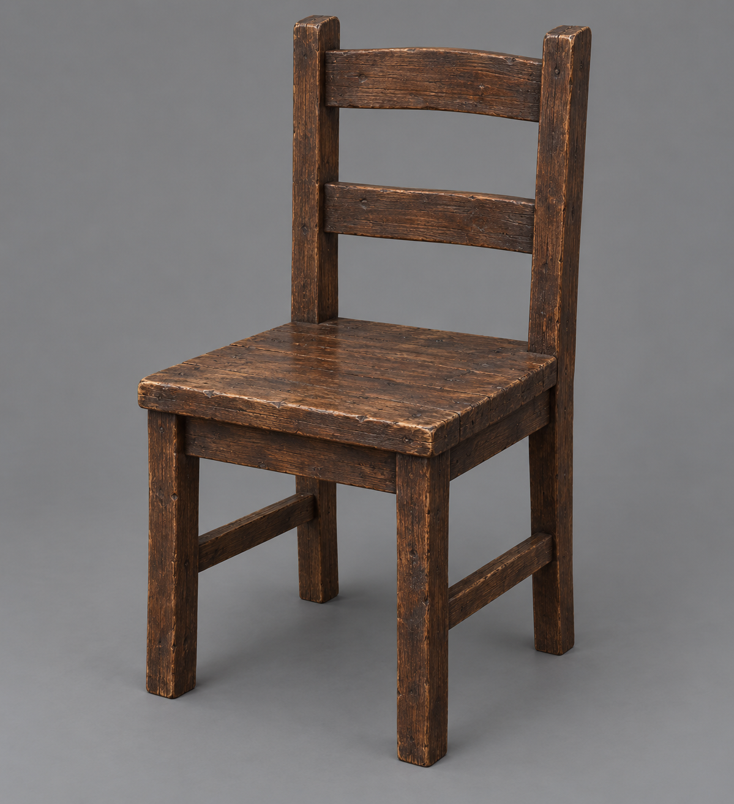

# 🖼️ 小屋木椅

已確認：爭執後博瑞屈站起離開，椅腳刮過木地板，椅子倒下；他在黎明前回來扶起椅子，坐下脫靴。正文沒有鎖定椅背形狀、木種、表面顏色或尺寸。

設定採無雕飾的樸素木椅：四腿、方形木座面、兩道橫木椅背、深棕磨舊木料。這些形制是視覺選擇，作為後續圖像一致性的約束，不當作原文指定。椅子完整但磨舊，不將爭執畫成斷裂家具。

## 生成提示詞

內建 imagegen，illustration-story。Assassin's Quest / 刺客任務，chapter 0002，setting id hut_wooden_chair。單張中性三分之四視角道具設定，成人尺寸樸素四腿木椅、方形木座面、兩道橫木椅背、深棕磨舊木料，完整可站穩。中性灰背景，寫實奇幻書籍插畫，克制材質與色彩。無人、手、額外物件、雕飾、徽章、皇冠、文字或水印；不是王座，不做破損殘骸。

視檢 v1 通過：四腿與方座面完整，兩道橫木椅背清楚，深棕磨舊木材與中性背景符合設定；沒有雕飾、人物、額外物件、文字或水印。

