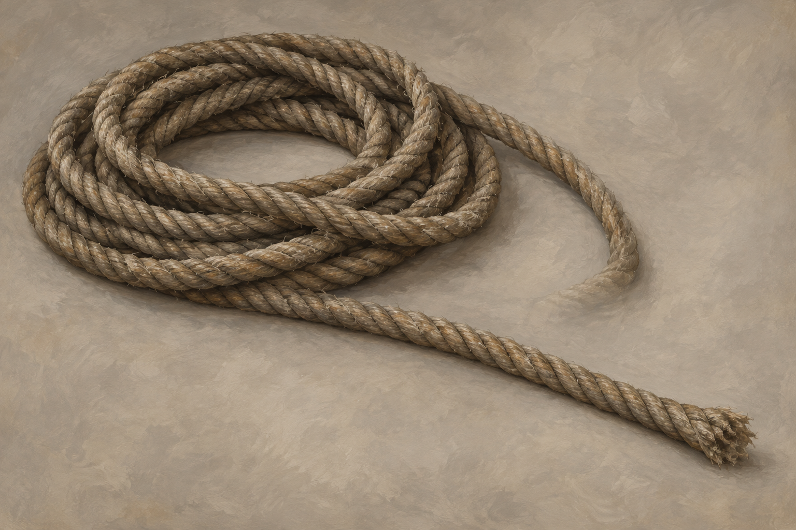

# 山崩中的救援繩索

## 已確認資訊

第二十八章，珂翠肯把繩的一端固定在傑帕空馬具上，盤繞另一段在肩側，再丟到蜚滋身邊。蜚滋抱著弄臣，騰出右手握繩，滑落時迅速把繩繞手腕一圈。傑帕行走與繩索阻力使他們越過鬆散岩屑，最後在平路丟下繩索。

正文未指定材質、粗細、長度、繩端處理或打結方式。設定稿採粗捻自然纖維、灰褐麻色與微磨毛表面，均是視覺詮釋，不是安全裝備規格。手腕繞繩只記故事動作，不提供現實救援指引。

## 設定稿與提示詞

Use case: illustration-story. Neutral prop reference for Assassin's Quest chapter 28, setting id landslide_rescue_rope. One continuous long traditional twisted natural-fiber rope, muted gray-brown hemp color, lightly worn strands, laid in a loose simple coil with one long section extending diagonally away. Thick enough to grasp with an adult hand, no measured dimensions. Entire object visible on plain warm gray background, soft diffuse neutral light, realistic oil-and-gouache fantasy book illustration, restrained texture. Fiber material and exact form are artistic interpretation. No people, hands, knots presented as instructions, harness, animals, equipment labels, text, magic, border, watermark, modern synthetic climbing gear or extra ropes.

## 視檢

v1 已打開視檢：單根灰褐捻纖維繩盤成鬆圈，延伸段與磨毛繩端可見；沒有現代裝備、人物、動物、文字、水印或示範繩結。中性底與低彩度符合系列設定，材質及精確輪廓僅作詮釋。
