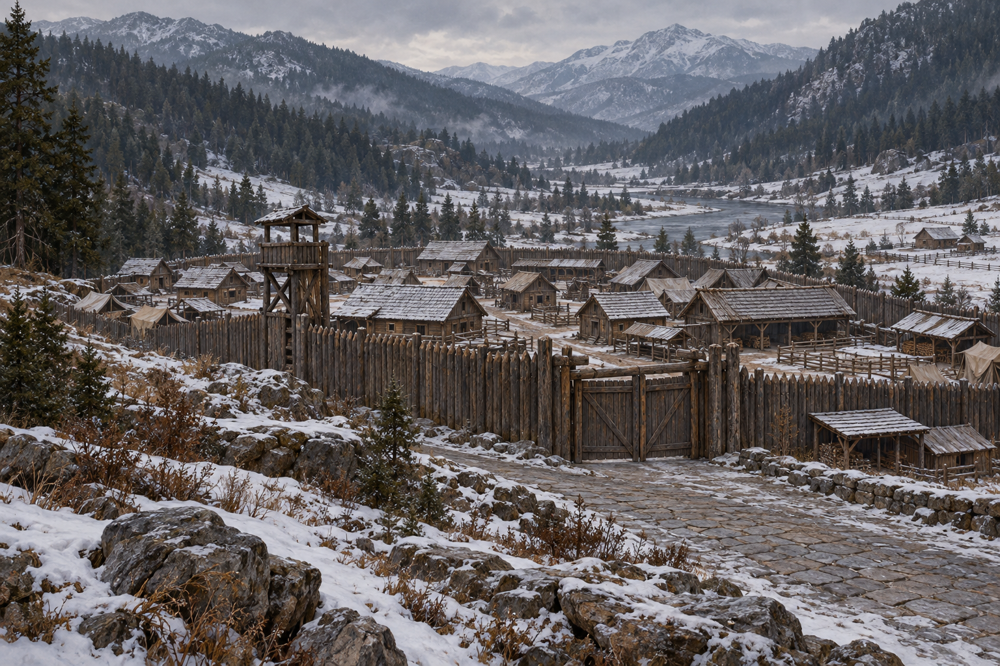

# 🖼️ 月眼邊境城鎮

本章確認：月眼位於六大公國與群山王國邊境，山谷裡規模小而能防禦的城鎮，外圍有農莊、木頭柵欄與相接的石板地。哨兵在城牆上方的烽火台盤問來客。它曾是軍事重地、商隊停靠處，如今重新成為軍事要塞；鎮內以木造建築為主，有穀倉、馬廄、低矮木屋，牆邊與建築間添了帳篷及披屋。

設定稿選火災之前的無人外景，木柵欄與小城輪廓可重複引用；不是被描繪成城堡的商業灘住宅，也不是大型石砌都城。精確柵欄高度、屋頂坡度、城门外形、道路布局與烽火台建法未知，採粗木柵欄、樸素木門、低層木屋及單一小型木哨台作詮釋；不畫固定軍徽、皇室旗幟或地名牌。

## 生成提示詞

內建 imagegen，illustration-story。Assassin's Quest chapter 0018，setting id moonseye_border_town。寬幅寫實奇幻油畫場景設定，冬日陰天的山谷邊境小城，由城外道路觀察。粗木柵欄、樸素木城門與單一小烽火哨台，柵欄外相接石板地，內部低層木屋、穀倉、馬廄，牆邊少量軍用帳篷與披屋，周圍稀疏農莊與林木山坡。冷灰與磨舊木材色，無人、動物、石砌城堡、王宮、巨大城牆、護城河、火災、旗徽、文字、水印或魔法。布局與光線為插畫詮釋。

視檢 v1 通過：木柵欄、小型木哨台、樸素城門、低層房舍和帳篷均可辨，無人、動物、城堡、軍徽、文字、水印或火災。山形、道路與遠處水面屬背景詮釋，不作已確認的月眼地圖；後續火災圖不引用該水面定位。

