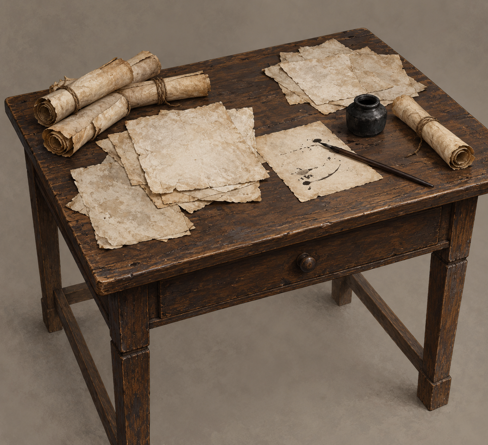

# 回憶寫字桌

已確認內容：敘述者有工作桌、凌亂的捲軸與紙張，早晨醒來手上仍沾墨。他寫歷史、論述、翻譯與謄錄，寫作常把他帶回自身記憶。男孩會送食物，本設定不含送餐，也不指定其身分。

視覺設定：簡單磨舊深棕木桌、粗淺色紙、鬆卷的紙卷、樸素深色筆與黑陶墨罐。材質、工具形制和擺位屬插畫選擇，不是正文逐項指定；不讓桌面變成王室奢華器物。紙上的零碎墨跡不可讀，不畫精確地圖、魔法符文或能透露未讀結果的正文。

設定範圍：只固定桌面組合，房間位置、窗向、年代與人物外貌仍開放。心得圖可改紙張姿態、光線與裁切，但保留凌亂多紙卷與樸素工作材質。此卡與第一冊 `writing_table_and_unfinished_page` 分開，避免把早期單張失敗書寫當成第三冊多年後的累積工作。

生成提示詞：中性三分之四俯視，完整簡單舊木桌、散紙與鬆卷紙卷、黑陶墨罐與深色樸素筆；灰米背景，寫實磨舊木紋與粗紙質地；无文字、人物、魔法、王權物件、武器、水印或未讀資訊。

