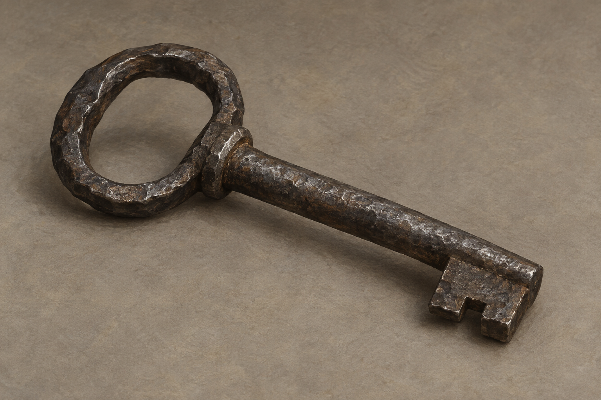

# 粗製鐐銬鑰匙

已確認：年輕侍衛拿著能解除蜚滋鐐銬的鑰匙，求救未果後將它拋遠；蜚滋搜尋到夕陽將沉才找到。鑰匙粗製濫造，在鎖中轉動費力，仍能開啟手鐐腳銬。來源與持有者身分不新增，找到鑰匙不表示他的傷勢或缺水已解決。

正文沒有指定金屬、尺寸、齒形與把手。本稿選掌長、暗灰鍛鐵、略不規則的橢圓圈柄、短直圓桿與單一帶缺口矩形齒，均為視覺詮釋。只固定一種可重複引用的輪廓，不作真實鎖具製作圖或結構斷面。沒有家徽、符文、寶石或魔法光。

設定稿採中性灰褐背景的三分之四近景，只畫一枚完整鑰匙。人物、手、鐐銬與其他物件不入畫。

## 生成提示詞

內建 imagegen；完整實際 prompt：

Use case: illustration-story. Asset: neutral prop design reference for Assassin's Quest, Farseer Trilogy volume 3, chapter 12 Suspicion. Setting id: rough_shackle_key. Make exactly ONE small crudely made historical key that can unlock iron shackles. The text specifies only crude manufacture, difficult turning, and functional success; the material and exact profile are artistic interpretation. Choose dark dull wrought iron, an imperfect simple oval loop bow, short straight solid cylindrical stem, and a single small rectangular ward with one coarse notch at its end. One coherent usable old key, modest palm-length, uneven handmade edges, light worn surface, not broken, not ornate. Neutral three-quarter macro view on plain matte warm gray background, completely visible with subtle natural shadow. Realistic painterly literary fantasy book illustration, muted brown-gray and charcoal palette, fine brush texture, restrained light, visibly tangible metal. No extra keys, key ring, chain, lock, shackles, jewelry, inscription, crest, rune, magical glow, hands, people, weapons, gore, panels, labels, text, border, or watermark. This is a reference study, not a triumphant treasure or modern door key.

## 視檢

v1 已打開檢查：只有一枚完整鑰匙，暗灰磨舊金屬、略不規則圈柄、短直桿與带缺口的矩形齒均可辨，無文字、水印與額外道具。接柄處小環狀肩台屬生成的造型詮釋，場景須連同保留；不能把此輪廓當成正文指定工藝。

