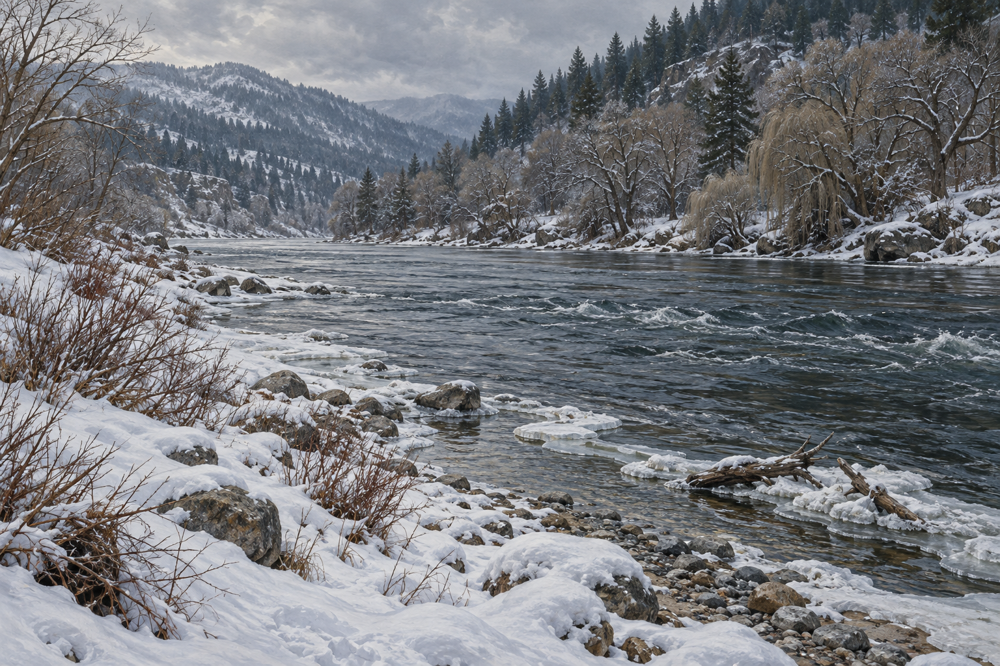

# 🖼️ 渡河前的雪河岸

已確認：蜚滋與夜眼在第二晚棲身的破屋附近沿河拾柴；河岸有積雪、砂礫與石頭，近岸有無葉灌木、雪丘與矮林。河邊多處結冰，但河流仍湍急，浮木帶著髒冰與雪漂過；對岸有萬年青密布的山麓，橡樹與柳樹平原延伸至河邊。本章未渡河。

插畫詮釋：河道彎曲、岸石位置、鏡頭方位、陰天灰藍光與浮木形狀。畫面左右不是小說地理定向；不固定河寬、地名或比例。蜚滋對火災阻隔的猜測不作客觀歷史。畫面不出現公鹿或獵物，因此不補另一個生物設定。

## 生成提示詞

內建 imagegen，illustration-story。Assassin's Quest chapter 0016，setting id snow_river_bank。無人物的寫實奇幻書籍場景設定圖，寬幅三分之四河岸視角；近岸積雪的砂礫石頭、無葉灌木與雪丘，灰藍河水湍急流動，岸邊不規則薄冰，水中少量帶冰雪浮木；對岸常綠山麓與延伸至水邊的橡柳樹林。自然陰天冬日光、細膩油畫筆觸。無橋、渡船、建築、人物、動物、魔法、文字、水印或戰火。河流不可完全封凍。

視檢 v1 通過：近岸冰雪砂礫與無葉灌木、未封凍水流、帶冰浮木和林木對岸均可辨。沒有橋、船、人物、動物、戰火、文字或水印；遠山與河彎屬構圖詮釋。

