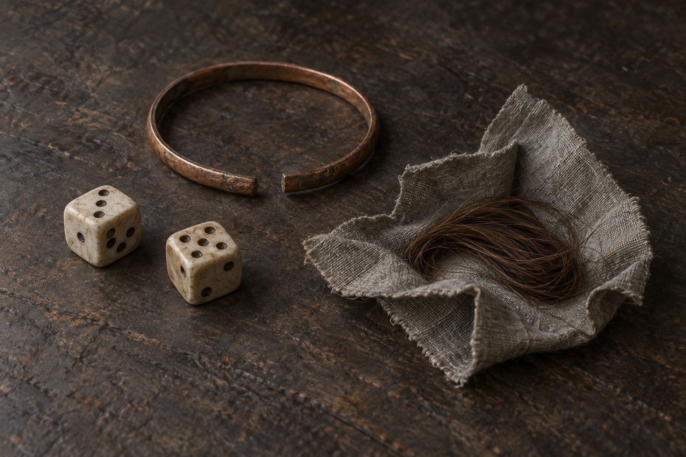

# 🖼️ 女兵的私人小物

蜚滋查看從女兵身上取得的錢包，發現打火石、五六枚錢幣、骰子、斷手鐲，以及小布包中的一綹細髮。他將頭髮、骰子與手鐲埋入土裡。本稿只設定這三類私人物件；不將錢幣或打火石一併畫成被埋。

髮束屬於誰、女兵姓名、鐲子的材質、布料顏色、骰子數量與材質均未確認。採棕色細髮、灰色小麻布、兩枚素骨色骰子與缺口銅色細鐲作視覺詮釋，不能据此補寫孩子、戀人或家族史。

## 生成提示詞與視檢

內建 imagegen。寬幅寫實奇幻書籍道具油畫，暗褐中性表面上分開陳列兩枚素骨色骰子、一只帶明顯斷口的樸素暗銅色細手鐲、小塊展開的灰麻布與一綹棕色細髮。冷灰、自然褐色、柔和自然光、清晰輪廓與磨舊材質，私人物件而非華麗寶藏。骰子數量、材質與顏色為詮釋。無錢包、錢幣、打火石、武器、珠寶、手、人物、肖像、標籤、文字、水印或魔法光；頭髮不得變成繩索或羽毛。

v1 已視檢：兩枚骰子、單一斷口細鐲、小布與髮束清楚可辨；未出現人物、文字或額外道具。骰面點數只為造型，非正文資訊。

