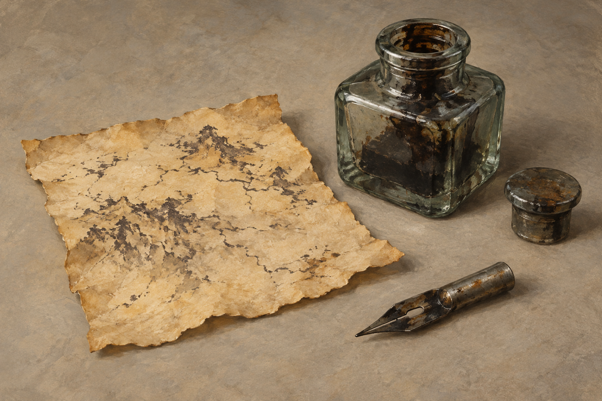

# 古城高塔的臨摹用具

## 已確認外觀與用途

第二十七章〈城市〉：蜚滋從腐壞紙堆找到一塊不比兩手大的羊皮碎片，已硬且發黃。沉重、有塞子的玻璃瓶內是結硬的墨；書寫工具木柄已失，只剩足以握住的金屬尖端。他重新磨淨筆尖，濕潤墨塊，臨摹白石嵌板上的道路、群山與符號，待墨乾後把紙收進襯衫。

這組用具不是第二十三章的古地圖，也不是塔中的黏土城市模型；三者不可互相替代。正文沒有指定玻璃色、瓶形、金屬成分、塞子材質或確切地形排列。

## 視覺鎖定與開放處

設定採一塊約兩掌大的不規則硬黃羊皮碎片、一枚短而能握住的無柄金屬筆尖、一只厚壁透明灰綠玻璃瓶與簡單塞子。玻璃色、塞子材質、器物輪廓與紙上抽象墨線是視覺詮釋。墨塊為深褐黑色，無魔法光；線痕不可讀，不補真實地理、路名、羅盤、目的地或預言。

## 設定稿提示詞

Use case: illustration-story. Asset type: neutral recurring prop reference, work Assassin's Quest, chapter 27, setting id tower_copying_kit. Three objects only: one irregular stiff yellowed parchment scrap approximately two adult palms in size, lying flat with sparse unreadable rough dark terrain strokes; one short tarnished metal writing nib long enough to hold, with absolutely no wooden handle; one heavy thick-walled slightly gray-green translucent glass ink bottle, containing dried dark brown-black ink, with a plain separate stopper beside its neck. Neutral warm gray background, all objects fully visible in a three-quarter overhead view, realistic painterly fantasy book illustration, oil and gouache texture, restrained ochre and charcoal, soft diffuse light. Exact shape and abstract ink strokes are artistic interpretation. No people, hands, map labels, letters, compass, identifiable geography, extra quill, feather, magic, frame, watermark, or text.

## 視檢

v1 已打開核對：一塊硬黃不規則羊皮碎片、一枚全金屬無木柄筆尖、一只厚壁灰綠玻璃瓶及獨立塞子；瓶內可見乾黑墨塊。紙上有不可讀地形線痕，沒有字母、地名、羅盤、人物或水印。紙張與瓶身比例、金屬形制和墨線是插画詮釋，不宣稱精確重現地圖。
