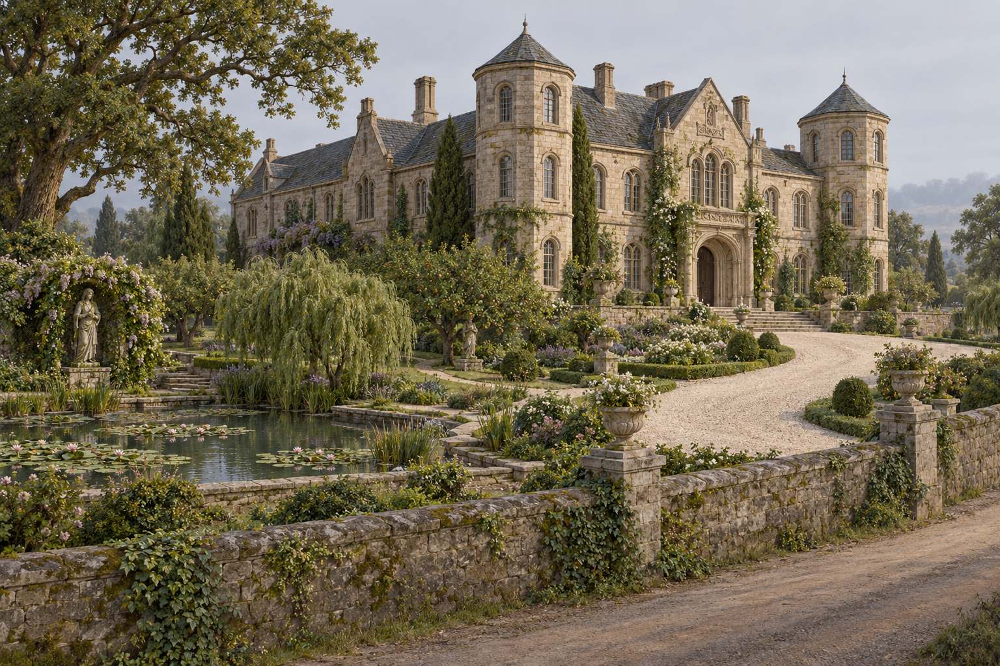

# 🖼️ 商業灘殿堂與花園

已確認：殿堂建於可看河流兩個方向的矮丘，為優雅奢華的石造住宅，石牆有精細花紋、入口高雅拱門。塔供觀景，沒有射箭洞口，整體沒有公鹿堡的軍事用途。公共道路與別墅間有低矮厚實石牆，帶苔蘚和常春藤；白卵石車道通向門口，小徑連接蓮花池、修剪果樹與林蔭路。雕像藏在花藤環繞的角落，老橡樹與柳樹在河風中搖擺。

本稿只建立供外景構圖引用的可見組合，非正文提供的完整平面圖。兩座塔、拱窗排列、石材的暖灰色、瓦色、花色、池形、樹木相對位置與建築翼數都是插畫詮釋；不聲稱存在特定房間或可行的潛入路線。吾王廣場是不同設施，不放進本殿堂庭園，也不自行補兵力、王室紋章與內裝。

## 生成提示詞

內建 imagegen，全新場景設定，不使用未讀圖像。完整實際提示詞：

Create a neutral architectural environment reference for Assassin's Quest / Farseer Trilogy volume 3 chapter 8, setting ID tradeford_hall_gardens. NO people or animals. A refined wealthy medieval fantasy stone country residence on a very LOW gently raised hill, three-quarter exterior view of a coherent palace-and-garden ensemble against plain pale gray distance in soft neutral daylight. This is an elegant residence, never a military fortress. Warm gray stone walls with fine restrained carved ornament, graceful arched main entrance and generous ordinary arched windows. Two modest scenic viewing towers with regular windows, NO arrow slits, crenellations, battlements, portcullis, moat or defensive high walls. A low THICK stone boundary wall with moss and ivy separates an empty public road from the gardens. White pebble carriage drive leads toward the entrance, smaller paths meander beside one quiet lotus pond and carefully pruned fruit trees. Mature oak and willow trees, some secluded unidentifiable stone statues partly hidden in flowering vines. Painterly realistic fantasy book illustration, worn stone, subdued foliage, earthy colors, readable architecture rather than fantasy spectacle. Exact tower count, wing arrangement, paving layout, pond shape, statue forms and colors are artistic interpretation. Show no signs, writing, readable heraldry, crowns, flags, weapons, prison, arena, corpses, fire, magic or later-chapter plot. Do not invent an interior plan or tactical infiltration diagram.

## 視檢

v1 已打開視檢：低牆、普通觀景窗、石拱入口、白卵石車道、池與老樹符合規格，但門楣有類字樣裝飾，未採作正式場景參考。v2 已打開視檢：門楣改成單純菱形石飾，無可讀文字；兩座觀景塔沒有箭孔或女牆，無高防禦牆、人物、軍隊或水印。雕像屬石材庭園裝飾，不是人物出場。拱窗、幾何飾與兩座塔為詮釋，不能當作精確原作建築圖。

v2 完整修正提示詞：

Edit this architectural illustration only to remove inscription-like decorative lettering in the horizontal stone lintel panel directly above the main arched entrance. Replace that narrow panel with plain unmarked aged stone or a simple geometric diamond relief containing absolutely NO letters, pseudo letters, writing, names or heraldry. Preserve all other architecture, proportions, towers, pond, plants, lighting and framing exactly. No additional changes.

