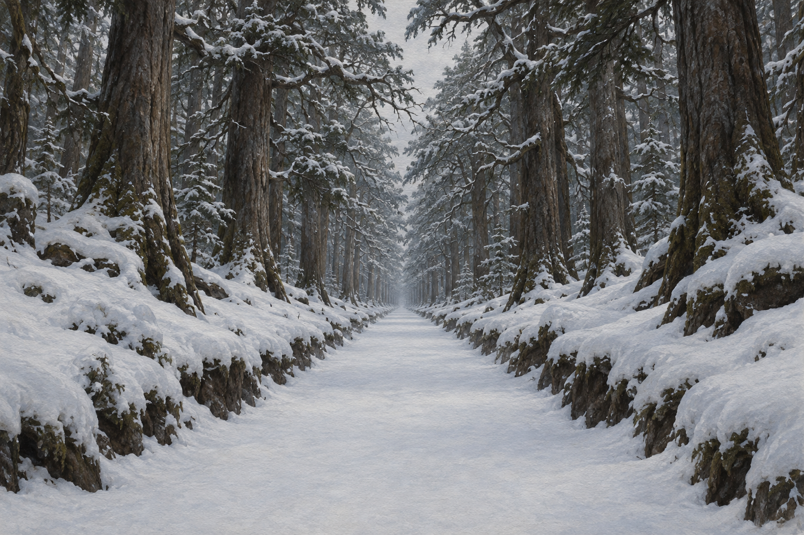

# 沒有足跡的古道

## 已確認外觀

第二十四章中，林間小徑通向一條寬廣、筆直穿越古老森林的道路。路面低於森林地面，積雪平整無痕；樹根沒有伸進路面，也沒有樹苗從路上長出。道路似乎向上延伸並蜿蜒過山丘，周遭沒有動物足跡。蜚滋感到精技的拉力，水壺嬸提到古老傳說中有由精技淬鍊之物；道路是否真由精技塑成仍是角色推想，不把傳說當成已確認的世界規則。

## 本圖鎖定與開放處

設定稿呈現積雪、筆直、略低於森林地面的空曠路帶，以及避開路面的古樹。雪的色澤、樹種、路段長度、視角與遠方霧氣是視覺詮釋。道路的年代、建造方式、終點及精技來源仍未確定；不添加石鋪、標記、足跡、人物、動物或超自然光效。

## 設定稿

- 完整提示詞：

> Use case: illustration-story reusable setting reference. Create a single landscape establishing study of an ancient road through an untouched mountain forest, relevant only to chapter 24 of Assassin's Quest / Farseer Trilogy volume 3. Show a broad, unnaturally straight, shallow sunken corridor running through a very old dense forest, disappearing into distance beneath branches that nearly arch overhead. The forest floor on both sides is uneven and deeply snow-covered; the road itself is also covered in perfectly smooth pristine snow, slightly lower than the surrounding ground, with absolutely no footprints, animal tracks, fallen branches, roots crossing it, or young trees growing from it. Tall ancient trees stand along both sides, their roots do not intrude into the road. Its long straight geometry should feel subtly uncanny and empty, yet still like a physical path in a literary fantasy landscape. Neutral overcast winter daylight, muted charcoal bark, cool gray-white snow, earth-dark edge shadows, restrained painterly oil-and-gouache book illustration with visible paper grain. Treat this as a reusable location reference plate, not a dramatic action scene. No people, animals, camp, tent, fire, carved stone, paving blocks, signs, symbols, magical light, glowing lines, text, lettering, frame, or watermark. Landscape composition.

## 視檢

v1 已打開檢查：古樹在路兩側形成拱頂，中央路面積雪平整、略低於周圍林地；沒有足跡、動物、人物、石鋪或發光符號。環境造型只參考正文外觀，沒有把角色關於精技的猜想畫成可見魔法。
