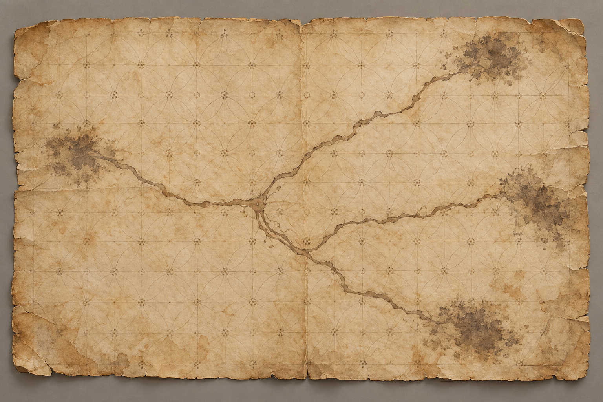

# 惟真留下的古地圖

## 已確認外觀

第二十三章明確寫出這是一張褪色羊皮紙，帶有花飾窗格線條；珂翠肯把它攤在腿上，以手指指出約略所在位置、戰爭遺跡與幾條分岔小徑。路線終端褪成漆黑陰影，起點和終點都不明。畫面沒有可讀地名，地圖比例也不可靠。

## 本圖鎖定與開放處

設定稿採舊羊皮紙、褪色花飾格線、分岔墨線與模糊深色端點。紙張完整度、泛黃程度、邊緣磨損與墨色濃淡是視覺詮釋。線條不指向任何真實地理，不增添標籤、字母、方向標記或後續才知道的地點；各支路實際通向何處仍未確定。

## 設定稿

- 完整提示詞：

> Use case: illustration-story setting reference. Create a single clean neutral prop study for a recurring map in a literary fantasy novel, relevant only to chapter 23 of Assassin's Quest / Farseer Trilogy volume 3. A single old parchment map, lying flat and viewed from directly above on a simple neutral warm gray background, entire sheet visible with generous margins. The parchment is faded and old but intact, with faint decorative flower-like lattice grid lines and a few branching ink paths that divide into three routes; their far endpoints are worn into indistinct dark smudges. Keep all map marks abstract and unreadable: absolutely no words, labels, letters, symbols, compass rose, real-world geography, or recognizable place names. Restrained ochre and faded sepia ink, subtle paper grain and worn edges. Realistic painterly book illustration with oil-and-gouache brushwork, neutral diffuse studio light, faithful object-reference plate rather than dramatic scene. No people, hands, other props, frame, title, watermark, or added features. Landscape format.

## 視檢

v1 已打開檢查：單張完整羊皮紙置於中性灰底，花飾格線清楚，墨線分岔，數個端點為模糊暗影。沒有文字、人物、羅盤、真實地理或水印。磨損與墨線形狀僅作設定視覺，不作路徑真相。
