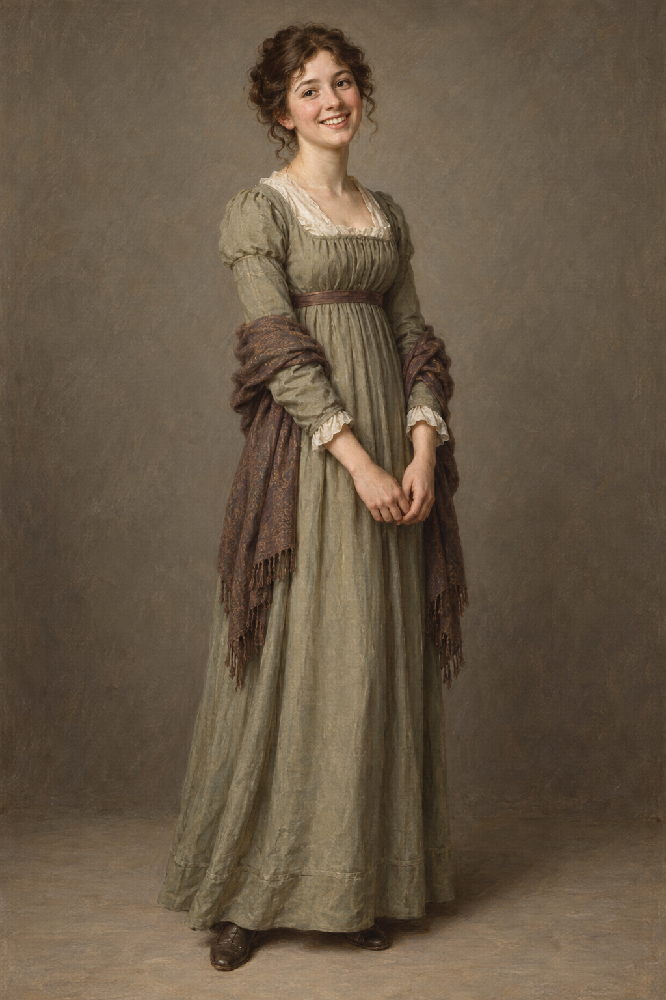

# 阿拉貝拉・伍德霍普 (Arabella Woodhope)

## 外貌與特徵

- 第二十二章時二十二歲，是助理牧師亨利・伍德霍普的妹妹。
- 靜止不語時，容貌與身姿都沒有突出的美貌特徵；一開口或露出笑容，神采便鮮明起來。
- 活潑、敏捷、開朗，不吝惜笑容；能迅速看穿斯特蘭奇把魔法當成創業計畫的玩笑。

## 敘事與未知處

本章直接呈現的是她與斯特蘭奇在雷蒙夫婦家中的談話，以及她看見鏡中書房時的驚訝。眼睛顏色、髮色與服裝細節未被明確描述；設定圖只採用符合助理牧師家庭場合的樸素 Regency 日常服作視覺提案。
