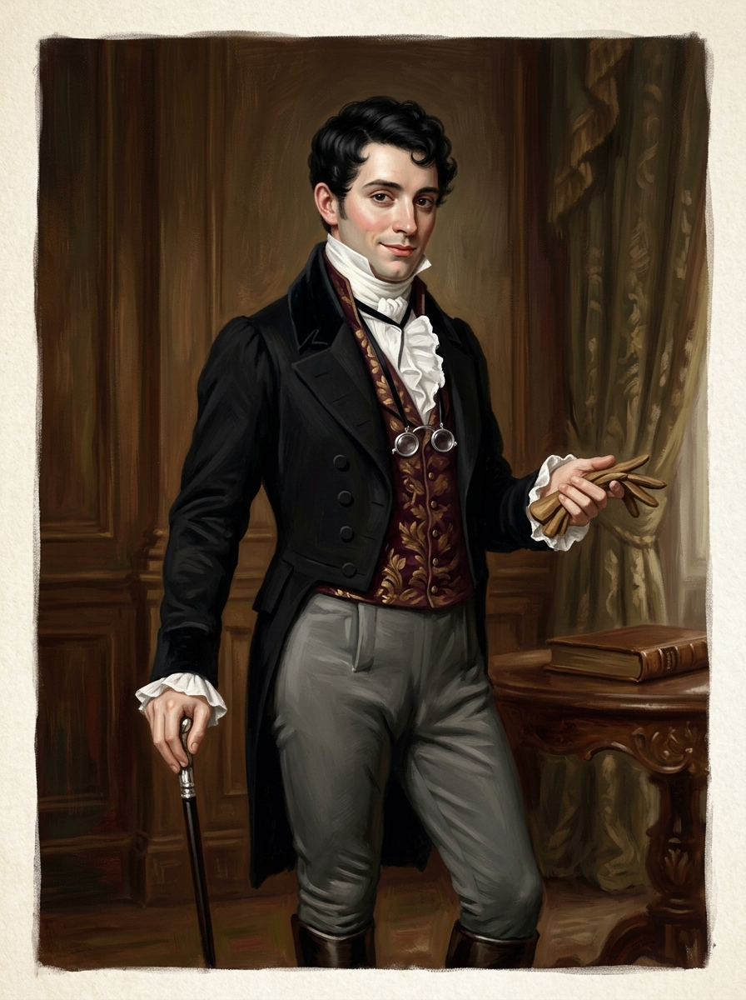

# 克里斯多福・德羅萊特 (Christopher Drawlight)

## 外貌與特徵
- **年齡與體態**：三十餘歲，身材嬌小纖細，舉止做作優雅，倫敦花花公子（Dandy）打扮。
- **面容與妝容**：五官勻稱漂亮，膚色白皙、面頰微施薄脂，短黑鬈髮，最出眾的是一雙大而黑亮如水潭般的雙眸，睫毛濃黑纖長。
- **服飾打扮**：做工考究的黑色燕尾服、挺括潔白的荷葉邊襯衫，胸前用黑天鵝絨帶子懸掛一副銀絲眼鏡；手持手套與手杖。
- **性格與行徑**：極度精於逢迎拍馬、搬弄是非、打聽豪門隱私與操縱婚事；在完全不認識諾瑞爾的情況下，單憑錯認齊爾德邁斯便在倫敦社交圈大肆宣稱自己是諾瑞爾的密友與「施洗約翰」。

## 敘事意義
倫敦名利場寄生客的典型化身。他將魔法視為最高階的社交談資與投機籌碼，是將避世孤僻的諾瑞爾強行拖入帝國社交與政治漩渦的第一個推手。
