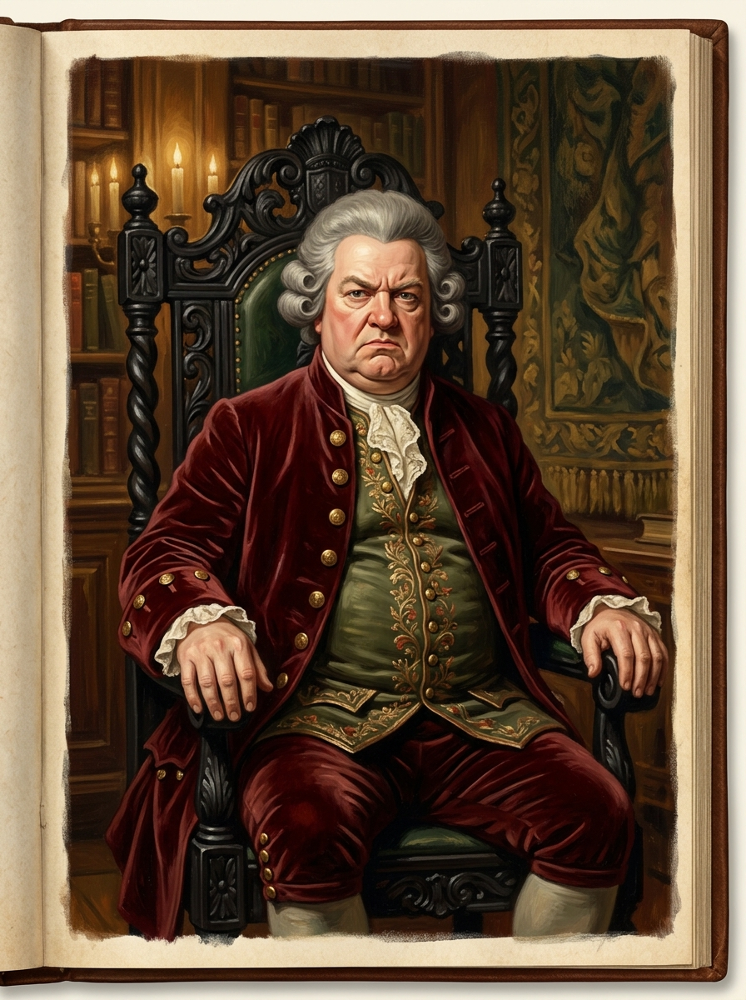

# 福克斯卡斯爾博士 (Dr. Foxcastle)

## 外貌與特徵
- **年齡與體態**：近六十歲，身材魁梧肥胖、頂著將軍肚，氣派威嚴，習慣雙手扣在腹前。
- **面容與打扮**：神情自負且剛愎，頭戴撲粉假髮，身著昂貴的暗紅天鵝絨燕尾服與金線刺繡背心。
- **身分**：約克魔法師學術協會主席，習慣坐在紅天鵝絨窗簾前的高大黑木雕花王座上。

## 敘事意義
約克清談派與體制權威的具象化。他代表了將魔法停留在「安全、高尚、不涉及實踐」的學術體制，當面對真正的實踐挑戰時，極度恐懼自身特權瓦解，最終在虛榮驅使下帶領全體會員簽下解散協議。
