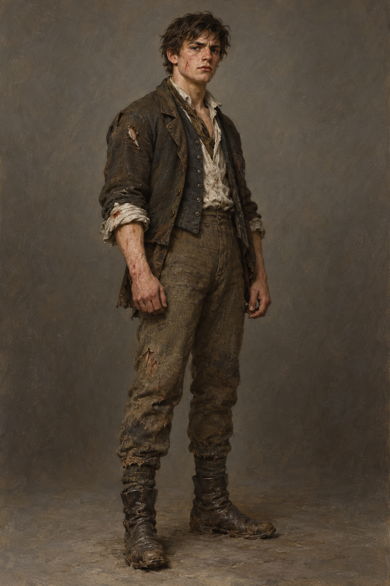

# 傑里米 (Jeremy)

## 已確認外貌與行為

- **身分與年齡感**：斯特蘭奇家新來的年輕男僕；確切年齡未鎖定，但身體強健，能在暴風雨與荊棘荒路中長途跋涉。
- **性格**：自認聰明能幹、容易把他人的要求解讀成對自己的重用；脾氣急、會大呼小叫，也有冷嘲熱諷與報復傾向。
- **能力與亮面**：辦事尚算明智，遇到救死扶傷時能奮不顧身；在第 014 章中承受荊棘、寒冷與病熱後仍活下來。
- **服飾與狀態**：穿著早十九世紀男僕的實用衣物；本章返家時衣服被荊棘撕破、身上帶血與泥，後來高燒並在書房地板上退燒熟睡。
- **敘事位置**：他既不是純粹受害者，也不是可靠英雄；他會把經歷誇張成自己的功勞，卻也開始替被勞倫斯壓迫的人感到憤怒。

## 劇透邊界

設定只鎖定第 014 章：新男僕、雪夜送信、荊棘荒路、發燒與書房中活下來的身體；不補入後續職位、關係或人物發展。
