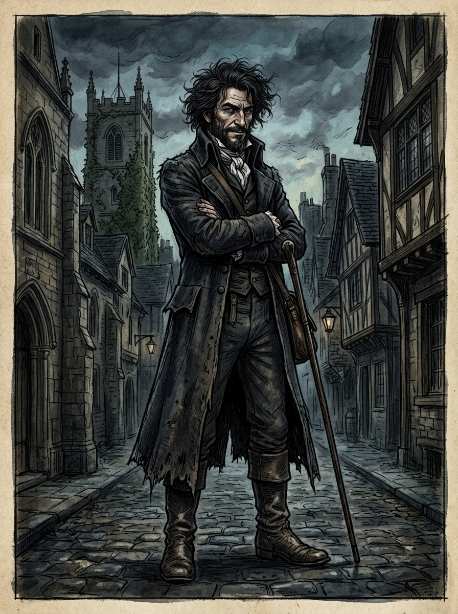

# 約翰・齊爾德邁斯 (John Childermass)

## 外貌與特徵
- **年齡與體態**：四十餘歲，身材高大精瘦，帶著冷峻而具備威懾力的氣場。
- **面容**：飽經風霜的剛毅輪廓，一頭如烏雲般黑且蓬亂糾結的長髮，眼神銳利、帶著看透一切的譏誚笑意。
- **服飾**：深色稍顯磨損的長款旅行外套，高立領，帶有哥特小說式浪人與密探氣質。
- **身份**：諾瑞爾先生的司務（Steward），兼具管家、保鏢與情報蒐集者的多重角色。

## 敘事與象徵意義
何妨寺秩序的影子看門人。他游走於紳士社會與底層黑市之間，清楚知道諾瑞爾的偏執與秘密，以嘲弄卻忠實的姿態守護著這道通往實踐魔法的私有門戶。
