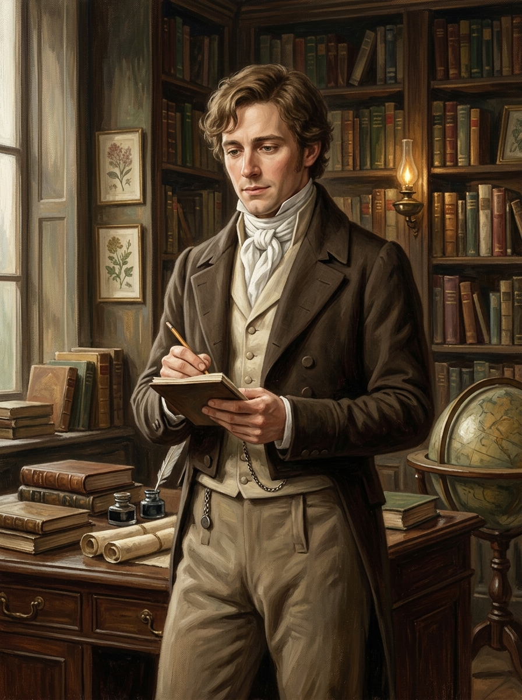

# 約翰・斯剛德斯 (John Segundus)

## 外貌與特徵
- **年齡與體態**：三十歲出頭，身形清瘦修長，氣質溫和、謙遜而內斂。
- **面容**：相貌清秀真誠，眼神專注而富於思索，容易靦腆臉紅。
- **服飾**：整潔但樸素的深褐色攝政時期紳士長外套、米色長褲、潔白領結。
- **特徵能力**：具備天生極佳的方向感（但在何妨寺內完全失效）；是唯一敢於在約克協會提出「為何魔法在英格蘭銷聲匿跡」本質問題的求真者。

## 敘事與象徵意義
代表了理智、誠摯與對底層真相充滿渴望的探索者。他在何妨寺敏銳地捕捉到空間的異樣、不可思議的光源以及被裁切的古書，成為讀者窺探諾瑞爾封閉體系的第一道視角。
