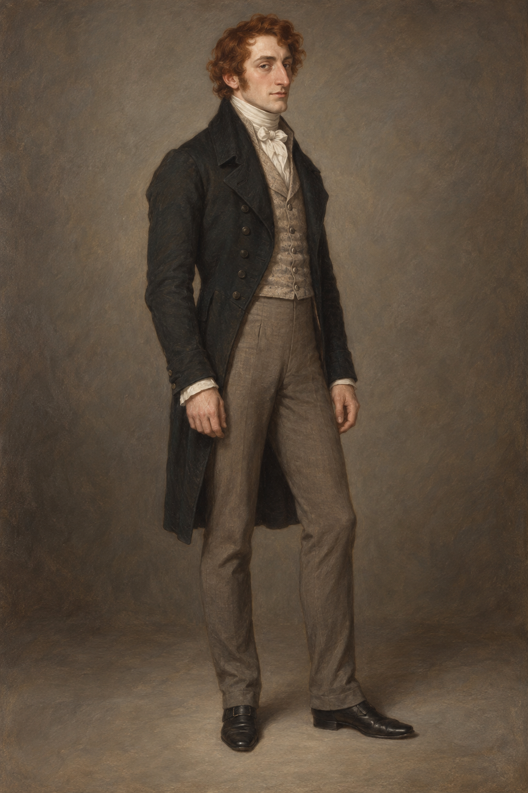

# 喬納森・斯特蘭奇 (Jonathan Strange)

## 外貌與特徵

- 第二十二章時二十八歲，個子高、身材結實。
- 頭髮帶紅色；鼻子偏長，臉上常帶著嘲諷似的神情。
- 他外表與父親迥異，性情不惡，卻尚未找到能長久投入的工作或志業。

## 敘事與未知處

他在第二十二章意外買到三條咒語，並用其中一道刺探咒首次看見諾瑞爾的書房。眼睛顏色、鬍鬚與日常服飾的精確款式尚未確定；場景插圖可以依場合改變姿勢與服裝，不追加固定標誌物。
