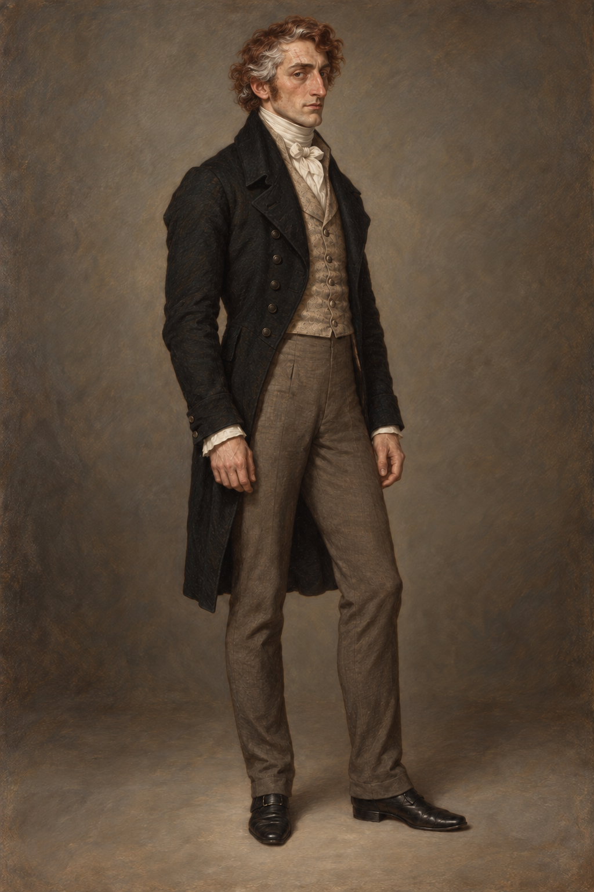

id: jonathan_strange_1814
name: 喬納森・斯特蘭奇（1814年返家後）
type: character
work: jonathan-strange-mr-norrell
first_appearance: "031"
last_updated: "2026-10-06"
image: ../RawImages/jonathan_strange_1814_v2.png
tags: [character, magician, strange, 1814]
---

# 喬納森・斯特蘭奇（1814年返家後）

## 時間與外貌依據

- 1814年5月返家時，阿拉貝拉確認他比記憶中更瘦、更黑，白髮增多，左眉上方多一道發白的舊傷疤；第37章時間為同年11月，沿用此時間變體。
- 以原人物 v1 的紅棕髮、長鼻輪廓為基礎；鬍鬚、眼睛顏色與固定服飾仍未確認。
- 深色攝政時期外套與白襯衣只作本次設定稿的服裝詮釋，不升格為固定系列服裝。

## 使用界線

第39章時間為1815年2月，仍沿用此戰後外貌變體；最近引用039。插圖停在他婉拒合作後的沉默，坐姿與克制神情為當次構圖，不作固定姿態。

第40章為1815年6月，最近引用040；臉部身分沿用。當次依正文穿深口袋春夏輕便外套，攜帶大綢傘，戰中渾身泥濘。戰前夜插圖取榆樹下的預兆，無需把當次夏衣升格成固定人物服裝，也不提前把翌日疲態全部畫進當晚。

適用於1814年5月返家後的場景。若章節另有服裝或外貌線索，逐章修正，不覆寫較早年份的 `jonathan_strange` 設定。
