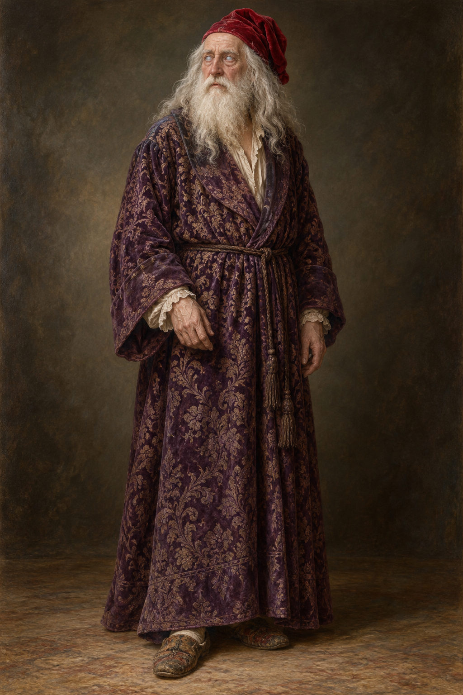

# 喬治國王

## 已確認外貌與當次服裝

第32章、1814年11月：老年男性，鬚髮皆白、長度相近，頭髮還摻少許灰色；面容有鬆弛的紅唇與破裂血管造成的斑痕。藍眼蒙白霧，視力失去。穿古舊紫色織錦緞睡袍、皺巴巴的鮮紅天鵝絨睡帽、又髒又破的拖鞋。以平靜的中性全身姿勢作設定，不把病痛誇張成醜態。

## 言行與邊界

他彈大鍵琴、唱德文歌，也吹笛子；小說中他能與斯特蘭奇看不見的銀髮人物交談。這是本章呈現的知覺差異，不替他作醫療診斷，也不由此鎖定未知人物的身分。本次不用王冠、權杖或約束衣替代他的衣著。

## 設定稿 prompt（built-in imagegen）

Use case: illustration-story. Work Jonathan Strange & Mr Norrell, chapter 32, setting id king_george_iii. Neutral full-body three-quarter reference portrait of an elderly British king as described in the novel, November 1814. Long white-gray hair and equally long white beard, aged face with restrained reddish broken-vessel marks, cloudy blue eyes suggesting lost sight without caricature. Worn purple brocade dressing gown, rumpled bright red velvet nightcap, old worn slippers. Calm human dignity, relaxed hands, muted neutral background. Classical British historical fantasy oil painting, detailed textile and skin textures. No crown, throne, scepter, military uniform, straitjacket, graphic wounds, text or watermark. No exaggerated madness or comic grimace.

